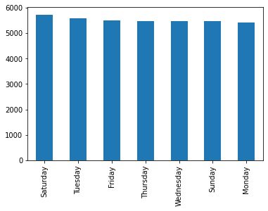
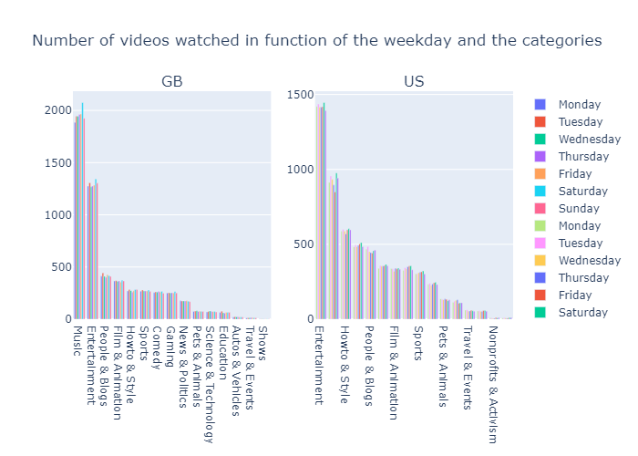
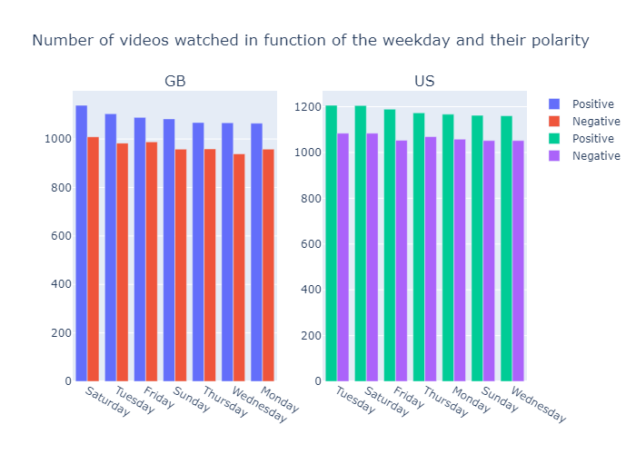
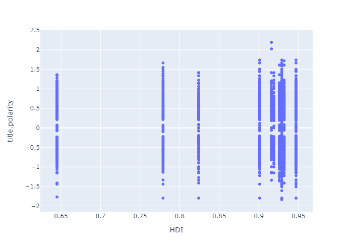

```python
import pandas as pd
import datetime
import calendar
import matplotlib.pyplot as plt
from plotly.subplots import make_subplots
import plotly.graph_objects as go
import plotly.express as px
import numpy as np
```


```python
dateparse = lambda x: datetime.datetime.strptime(x, '%y.%d.%m')
```


```python
df = pd.read_csv('youtubesenttitle.csv', encoding='utf-8', encoding_errors='ignore', parse_dates=['trending_date'], date_parser=dateparse)
```


```python
df
```


<div>
<style scoped>
    .dataframe tbody tr th:only-of-type {
        vertical-align: middle;
    }

    .dataframe tbody tr th {
        vertical-align: top;
    }

    .dataframe thead th {
        text-align: right;
    }
</style>
<table border="1" class="dataframe">
  <thead>
    <tr style="text-align: right;">
      <th></th>
      <th>category_id</th>
      <th>category_title</th>
      <th>country_code</th>
      <th>video_id</th>
      <th>trending_date</th>
      <th>title</th>
      <th>channel_title</th>
      <th>publish_time</th>
      <th>tags</th>
      <th>views</th>
      <th>...</th>
      <th>comments_disabled</th>
      <th>ratings_disabled</th>
      <th>video_error_or_removed</th>
      <th>description</th>
      <th>clean_title</th>
      <th>title.wc</th>
      <th>title.polarity</th>
      <th>title.pos.words</th>
      <th>title.neg.words</th>
      <th>title.text.var</th>
    </tr>
  </thead>
  <tbody>
    <tr>
      <th>0</th>
      <td>1</td>
      <td>Film &amp; Animation</td>
      <td>CA</td>
      <td>X2HfBoQeDW4</td>
      <td>2017-12-11</td>
      <td>Film Theory: How Luke will DIE (Star Wars: The...</td>
      <td>The Film Theorists</td>
      <td>2017-12-07T21:05:16Z</td>
      <td>star wars|star wars trailer|the last jedi|star...</td>
      <td>1593715</td>
      <td>...</td>
      <td>False</td>
      <td>False</td>
      <td>False</td>
      <td>SUBSCRIBE for More Film Theories! ► http://bit...</td>
      <td>Film Theory  How Luke will DIE  Star Wars  The...</td>
      <td>13</td>
      <td>-0.277350</td>
      <td>NaN</td>
      <td>NaN</td>
      <td>Film Theory  How Luke will DIE  Star Wars  The...</td>
    </tr>
    <tr>
      <th>1</th>
      <td>1</td>
      <td>Film &amp; Animation</td>
      <td>CA</td>
      <td>7hws55huP_A</td>
      <td>2018-06-07</td>
      <td>مسلسل الخاوة الجزء الثاني - الحلقة 21 Feuillet...</td>
      <td>الخاوة ـ القناة الرسمية</td>
      <td>2018-06-06T23:00:00Z</td>
      <td>Yasmine Amari|The voice|Mohamed Reghis|Cheb Ne...</td>
      <td>278600</td>
      <td>...</td>
      <td>False</td>
      <td>False</td>
      <td>False</td>
      <td>Si la première saison tournait autour d’un vie...</td>
      <td>21 Feuillet...</td>
      <td>5</td>
      <td>0.000000</td>
      <td>NaN</td>
      <td>NaN</td>
      <td>21 Feuillet...</td>
    </tr>
    <tr>
      <th>2</th>
      <td>1</td>
      <td>Film &amp; Animation</td>
      <td>CA</td>
      <td>ZHbT3LWwsQ0</td>
      <td>2018-06-13</td>
      <td>Film Theory: How To SAVE Jurassic Park (Jurass...</td>
      <td>The Film Theorists</td>
      <td>2018-06-12T18:09:35Z</td>
      <td>Jurassic|jurassic world|jurassic park|jurassic...</td>
      <td>1297543</td>
      <td>...</td>
      <td>False</td>
      <td>False</td>
      <td>False</td>
      <td>Watch Us Make A Jurassic Fossil Cake! ► https:...</td>
      <td>Film Theory  How To SAVE Jurassic Park  Jurass...</td>
      <td>9</td>
      <td>0.000000</td>
      <td>NaN</td>
      <td>NaN</td>
      <td>Film Theory  How To SAVE Jurassic Park  Jurass...</td>
    </tr>
    <tr>
      <th>3</th>
      <td>1</td>
      <td>Film &amp; Animation</td>
      <td>CA</td>
      <td>QbisKfwf6QY</td>
      <td>2018-01-26</td>
      <td>The Flash 4x11 No one Can Bully Barry Even In ...</td>
      <td>Celeb Interview</td>
      <td>2018-01-24T12:41:19Z</td>
      <td>The Flash Episode 4x11|The Flash Episode 4x12|...</td>
      <td>1829800</td>
      <td>...</td>
      <td>False</td>
      <td>False</td>
      <td>False</td>
      <td>The Flash 4x11 No one Can Bully Barry Even In ...</td>
      <td>The Flash 4x11 No one Can Bully Barry Even In ...</td>
      <td>15</td>
      <td>0.000000</td>
      <td>NaN</td>
      <td>NaN</td>
      <td>The Flash 4x11 No one Can Bully Barry Even In ...</td>
    </tr>
    <tr>
      <th>4</th>
      <td>1</td>
      <td>Film &amp; Animation</td>
      <td>CA</td>
      <td>FyZMnhUtLfE</td>
      <td>2017-11-14</td>
      <td>猎场 | Game Of Hunting 12【TV版】（胡歌、張嘉譯、祖峰等主演）</td>
      <td>大劇獨播</td>
      <td>2017-11-12T16:00:01Z</td>
      <td>電視劇|大陸電視劇|猎场|职场|商战|爱情|都市|胡歌|陈龙|孙红雷|张嘉译|祖峰|李强|胡...</td>
      <td>158815</td>
      <td>...</td>
      <td>False</td>
      <td>False</td>
      <td>False</td>
      <td>Thanks for watching the drama! Help more peopl...</td>
      <td>Game Of Hunting 12 TV</td>
      <td>4</td>
      <td>0.000000</td>
      <td>NaN</td>
      <td>NaN</td>
      <td>Game Of Hunting 12 TV</td>
    </tr>
    <tr>
      <th>...</th>
      <td>...</td>
      <td>...</td>
      <td>...</td>
      <td>...</td>
      <td>...</td>
      <td>...</td>
      <td>...</td>
      <td>...</td>
      <td>...</td>
      <td>...</td>
      <td>...</td>
      <td>...</td>
      <td>...</td>
      <td>...</td>
      <td>...</td>
      <td>...</td>
      <td>...</td>
      <td>...</td>
      <td>...</td>
      <td>...</td>
      <td>...</td>
    </tr>
    <tr>
      <th>360657</th>
      <td>43</td>
      <td>Shows</td>
      <td>US</td>
      <td>V6ElE2xs48c</td>
      <td>2018-05-20</td>
      <td>Game of Zones - S5:E5: The Isle of Van Gundy</td>
      <td>Bleacher Report</td>
      <td>2018-05-10T21:01:22Z</td>
      <td>bleacher report|br|nba|Stan Van Gundy|Jeff Van...</td>
      <td>1151096</td>
      <td>...</td>
      <td>False</td>
      <td>False</td>
      <td>False</td>
      <td>On an island full of Van Gundys, Stan gets tal...</td>
      <td>Game of Zones   S5 E5  The Isle of Van Gundy</td>
      <td>10</td>
      <td>0.000000</td>
      <td>NaN</td>
      <td>NaN</td>
      <td>Game of Zones   S5 E5  The Isle of Van Gundy</td>
    </tr>
    <tr>
      <th>360658</th>
      <td>43</td>
      <td>Shows</td>
      <td>US</td>
      <td>Q1CFfU2gXHw</td>
      <td>2018-01-27</td>
      <td>Apple HomePod: Everything to know before you b...</td>
      <td>CNET</td>
      <td>2018-01-24T20:08:16Z</td>
      <td>Apple|Homepod|smart home|Google Home|Amazon Ec...</td>
      <td>52255</td>
      <td>...</td>
      <td>False</td>
      <td>False</td>
      <td>False</td>
      <td>We'll break down all the new Apple HomePod det...</td>
      <td>Apple HomePod  Everything to know before you b...</td>
      <td>10</td>
      <td>0.000000</td>
      <td>NaN</td>
      <td>NaN</td>
      <td>Apple HomePod  Everything to know before you b...</td>
    </tr>
    <tr>
      <th>360659</th>
      <td>43</td>
      <td>Shows</td>
      <td>US</td>
      <td>Q1CFfU2gXHw</td>
      <td>2018-01-30</td>
      <td>Apple HomePod: Everything to know before you b...</td>
      <td>CNET</td>
      <td>2018-01-24T20:08:16Z</td>
      <td>Apple|Homepod|smart home|Google Home|Amazon Ec...</td>
      <td>72607</td>
      <td>...</td>
      <td>False</td>
      <td>False</td>
      <td>False</td>
      <td>We'll break down all the new Apple HomePod det...</td>
      <td>Apple HomePod  Everything to know before you b...</td>
      <td>10</td>
      <td>0.000000</td>
      <td>NaN</td>
      <td>NaN</td>
      <td>Apple HomePod  Everything to know before you b...</td>
    </tr>
    <tr>
      <th>360660</th>
      <td>43</td>
      <td>Shows</td>
      <td>US</td>
      <td>Q1CFfU2gXHw</td>
      <td>2018-01-29</td>
      <td>Apple HomePod: Everything to know before you b...</td>
      <td>CNET</td>
      <td>2018-01-24T20:08:16Z</td>
      <td>Apple|Homepod|smart home|Google Home|Amazon Ec...</td>
      <td>66284</td>
      <td>...</td>
      <td>False</td>
      <td>False</td>
      <td>False</td>
      <td>We'll break down all the new Apple HomePod det...</td>
      <td>Apple HomePod  Everything to know before you b...</td>
      <td>10</td>
      <td>0.000000</td>
      <td>NaN</td>
      <td>NaN</td>
      <td>Apple HomePod  Everything to know before you b...</td>
    </tr>
    <tr>
      <th>360661</th>
      <td>43</td>
      <td>Shows</td>
      <td>US</td>
      <td>7_FJUSBFbJM</td>
      <td>2018-04-21</td>
      <td>Game of Zones - Game of Zones - S5:E1: 'A Gold...</td>
      <td>Bleacher Report</td>
      <td>2018-04-12T21:00:12Z</td>
      <td>bleacher report|br|nba|game of zones|golden st...</td>
      <td>1300682</td>
      <td>...</td>
      <td>False</td>
      <td>False</td>
      <td>False</td>
      <td>In the season 5 premiere of Game of Zones, the...</td>
      <td>Game of Zones   Game of Zones   S5 E1   A Gold...</td>
      <td>11</td>
      <td>0.301511</td>
      <td>NaN</td>
      <td>NaN</td>
      <td>Game of Zones   Game of Zones   S5 E1   A Gold...</td>
    </tr>
  </tbody>
</table>
<p>360662 rows × 24 columns</p>
</div>


```python
df_gb = df[df['country_code'] == 'GB']
df_gb = df_gb.reset_index(drop=True)
df_us = df[df['country_code'] == 'US']
df_us = df_us.reset_index(drop=True)
```


```python
def date_to_weekday(d):
    d = d.date()
    d = d.weekday()
    d = calendar.day_name[d]
    return d
```


```python
df_gb['weekday'] = ''
df_gb['weekday'] = df_gb.apply(lambda x: date_to_weekday(x['trending_date']), axis=1)
df_gb['weekday']
```


    0         Thursday
    1           Friday
    2         Saturday
    3        Wednesday
    4         Thursday
               ...    
    38650     Thursday
    38651      Tuesday
    38652       Monday
    38653      Tuesday
    38654       Friday
    Name: weekday, Length: 38655, dtype: object


```python
df_us['weekday'] = ''
df_us['weekday'] = df_us.apply(lambda x: date_to_weekday(x['trending_date']), axis=1)
```


```python
fig, ax = plt.subplots()
df_gb['weekday'].value_counts().plot(ax=ax, kind='bar')
```


    <AxesSubplot:>


    

    


```python
fig = make_subplots(rows=1, cols=2,subplot_titles=("GB", "US"))

fig.add_trace(go.Bar(name = "Monday",y=df_gb[df_gb['weekday'] == 'Monday']["category_title"].value_counts(
), x=df_gb[df_gb['weekday'] == 'Monday']["category_title"].value_counts().index),row=1, col=1)

fig.add_trace(go.Bar(name = "Tuesday",y=df_gb[df_gb['weekday'] == 'Tuesday']["category_title"].value_counts(
), x=df_gb[df_gb['weekday'] == 'Tuesday']["category_title"].value_counts().index),row=1, col=1)

fig.add_trace(go.Bar(name = "Wednesday",y=df_gb[df_gb['weekday'] == 'Wednesday']["category_title"].value_counts(
), x=df_gb[df_gb['weekday'] == 'Wednesday']["category_title"].value_counts().index),row=1, col=1)

fig.add_trace(go.Bar(name = "Thursday",y=df_gb[df_gb['weekday'] == 'Thursday']["category_title"].value_counts(
), x=df_gb[df_gb['weekday'] == 'Thursday']["category_title"].value_counts().index),row=1, col=1)

fig.add_trace(go.Bar(name = "Friday",y=df_gb[df_gb['weekday'] == 'Friday']["category_title"].value_counts(
), x=df_gb[df_gb['weekday'] == 'Friday']["category_title"].value_counts().index),row=1, col=1)

fig.add_trace(go.Bar(name = "Saturday",y=df_gb[df_gb['weekday'] == 'Saturday']["category_title"].value_counts(
), x=df_gb[df_gb['weekday'] == 'Saturday']["category_title"].value_counts().index),row=1, col=1)

fig.add_trace(go.Bar(name = "Sunday",y=df_gb[df_gb['weekday'] == 'Sunday']["category_title"].value_counts(
), x=df_gb[df_gb['weekday'] == 'Sunday']["category_title"].value_counts().index),row=1, col=1)

fig.add_trace(go.Bar(name = "Monday",y=df_us[df_us['weekday'] == 'Monday']["category_title"].value_counts(
), x=df_us[df_us['weekday'] == 'Monday']["category_title"].value_counts().index),row=1, col=2)

fig.add_trace(go.Bar(name = "Tuesday",y=df_us[df_us['weekday'] == 'Tuesday']["category_title"].value_counts(
), x=df_us[df_us['weekday'] == 'Tuesday']["category_title"].value_counts().index),row=1, col=2)

fig.add_trace(go.Bar(name = "Wednesday",y=df_us[df_us['weekday'] == 'Wednesday']["category_title"].value_counts(
), x=df_us[df_us['weekday'] == 'Wednesday']["category_title"].value_counts().index),row=1, col=2)

fig.add_trace(go.Bar(name = "Thursday",y=df_us[df_us['weekday'] == 'Thursday']["category_title"].value_counts(
), x=df_us[df_us['weekday'] == 'Thursday']["category_title"].value_counts().index),row=1, col=2)

fig.add_trace(go.Bar(name = "Friday",y=df_us[df_us['weekday'] == 'Friday']["category_title"].value_counts(
), x=df_us[df_us['weekday'] == 'Friday']["category_title"].value_counts().index),row=1, col=2)

fig.add_trace(go.Bar(name = "Saturday",y=df_us[df_us['weekday'] == 'Saturday']["category_title"].value_counts(
), x=df_us[df_us['weekday'] == 'Saturday']["category_title"].value_counts().index),row=1, col=2)

fig.add_trace(go.Bar(name = "Sunday",y=df_us[df_us['weekday'] == 'Sunday']["category_title"].value_counts(
), x=df_us[df_us['weekday'] == 'Sunday']["category_title"].value_counts().index),row=1, col=2)

fig.update(layout_title_text='Number of videos watched in function of the weekday and the categories',
           layout_showlegend=True)
fig = go.Figure(fig)

fig.show(renderer="png")
```


    

    


```python
fig = make_subplots(rows=1, cols=2,subplot_titles=("GB", "US"))

fig.add_trace(go.Bar(name = "Positive",y=df_gb[df_gb["title.polarity"] > 0]["weekday"].value_counts(
), x=df_gb[df_gb["title.polarity"] > 0]["weekday"].value_counts().index),row=1, col=1)

fig.add_trace(go.Bar(name = "Negative",y=df_gb[df_gb["title.polarity"] < 0]["weekday"].value_counts(
), x=df_gb[df_gb["title.polarity"] < 0]["weekday"].value_counts().index),row=1, col=1)

fig.add_trace(go.Bar(name = "Positive",y=df_us[df_us["title.polarity"] > 0]["weekday"].value_counts(
), x=df_us[df_us["title.polarity"] > 0]["weekday"].value_counts().index),row=1, col=2)

fig.add_trace(go.Bar(name = "Negative",y=df_us[df_us["title.polarity"] < 0]["weekday"].value_counts(
), x=df_us[df_us["title.polarity"] < 0]["weekday"].value_counts().index),row=1, col=2)

fig.update(layout_title_text='Number of videos watched in function of the weekday and their polarity',
           layout_showlegend=True)
fig = go.Figure(fig)
fig.show(renderer="png")
```


    

    


```python
x = df['country_code']
condlist = [x == 'CA', x == 'DE', x == 'FR', x == 'GB', x == 'IN', x == 'JP', x == 'KR', x == 'MX', x == 'RU', x == 'US']
choicelist_HDI = [0.929, 0.947, 0.901, 0.932, 0.645, 0.919, 0.916, 0.779, 0.824, 0.926]
choicelist_IHDI = [0.848, 0.869, 0.820, 0.856, 0.475, 0.843, 0.815, 0.613, 0.740, 0.808]
choicelist_happiness = [7.103, 7.155, 6.69, 7.064, 3.819, 5.94, 5.845, 6.317, 5.477, 6.951]
df['HDI'] = np.select(condlist, choicelist_HDI)
df['IHDI'] = np.select(condlist,choicelist_IHDI)
df['happiness'] = np.select(condlist,choicelist_happiness)
```


```python
fig = px.scatter(df, y="title.polarity", x="HDI")
fig.show(renderer="png")
```


    

    


```python
df_by_country_mean = df[df['title.polarity'] != 0].groupby('country_code').mean(numeric_only=True)
df_by_country_max = df[df['title.polarity'] != 0].groupby('country_code').max(numeric_only=True)
df_by_country_min = df[df['title.polarity'] != 0].groupby('country_code').min(numeric_only=True)
df_by_country_mean.sort_values(by='HDI',inplace=True)
df_by_country_max.sort_values(by='IHDI',inplace=True)
df_by_country_min.sort_values(by='happiness',inplace=True)
df_by_country_mean
```


<div>
<style scoped>
    .dataframe tbody tr th:only-of-type {
        vertical-align: middle;
    }

    .dataframe tbody tr th {
        vertical-align: top;
    }

    .dataframe thead th {
        text-align: right;
    }
</style>
<table border="1" class="dataframe">
  <thead>
    <tr style="text-align: right;">
      <th></th>
      <th>category_id</th>
      <th>views</th>
      <th>likes</th>
      <th>dislikes</th>
      <th>comment_count</th>
      <th>comments_disabled</th>
      <th>ratings_disabled</th>
      <th>video_error_or_removed</th>
      <th>title.wc</th>
      <th>title.polarity</th>
      <th>title.pos.words</th>
      <th>title.neg.words</th>
      <th>HDI</th>
      <th>IHDI</th>
      <th>happiness</th>
    </tr>
    <tr>
      <th>country_code</th>
      <th></th>
      <th></th>
      <th></th>
      <th></th>
      <th></th>
      <th></th>
      <th></th>
      <th></th>
      <th></th>
      <th></th>
      <th></th>
      <th></th>
      <th></th>
      <th></th>
      <th></th>
    </tr>
  </thead>
  <tbody>
    <tr>
      <th>IN</th>
      <td>22.244935</td>
      <td>1.016728e+06</td>
      <td>26551.102832</td>
      <td>1347.046183</td>
      <td>2800.931829</td>
      <td>0.038886</td>
      <td>0.029189</td>
      <td>0.000000</td>
      <td>7.856265</td>
      <td>0.042633</td>
      <td>NaN</td>
      <td>NaN</td>
      <td>0.645</td>
      <td>0.475</td>
      <td>3.819</td>
    </tr>
    <tr>
      <th>MX</th>
      <td>19.741339</td>
      <td>6.650763e+05</td>
      <td>29625.974941</td>
      <td>1254.787756</td>
      <td>3534.728557</td>
      <td>0.007904</td>
      <td>0.010427</td>
      <td>0.000673</td>
      <td>9.754120</td>
      <td>-0.024432</td>
      <td>NaN</td>
      <td>NaN</td>
      <td>0.779</td>
      <td>0.613</td>
      <td>6.317</td>
    </tr>
    <tr>
      <th>RU</th>
      <td>20.484344</td>
      <td>2.023428e+05</td>
      <td>10360.613267</td>
      <td>1332.716013</td>
      <td>1402.623573</td>
      <td>0.024322</td>
      <td>0.023716</td>
      <td>0.000000</td>
      <td>0.282882</td>
      <td>0.126093</td>
      <td>NaN</td>
      <td>NaN</td>
      <td>0.824</td>
      <td>0.740</td>
      <td>5.477</td>
    </tr>
    <tr>
      <th>FR</th>
      <td>20.197145</td>
      <td>5.502590e+05</td>
      <td>20829.845101</td>
      <td>950.611481</td>
      <td>2165.641600</td>
      <td>0.015744</td>
      <td>0.014668</td>
      <td>0.000000</td>
      <td>6.913554</td>
      <td>0.009402</td>
      <td>NaN</td>
      <td>NaN</td>
      <td>0.901</td>
      <td>0.820</td>
      <td>6.690</td>
    </tr>
    <tr>
      <th>KR</th>
      <td>21.060924</td>
      <td>3.680567e+05</td>
      <td>9130.955475</td>
      <td>333.810221</td>
      <td>1531.968632</td>
      <td>0.016876</td>
      <td>0.034228</td>
      <td>0.000715</td>
      <td>0.647185</td>
      <td>0.415986</td>
      <td>NaN</td>
      <td>NaN</td>
      <td>0.916</td>
      <td>0.815</td>
      <td>5.845</td>
    </tr>
    <tr>
      <th>JP</th>
      <td>20.062228</td>
      <td>2.185618e+05</td>
      <td>7224.078057</td>
      <td>320.096665</td>
      <td>993.204809</td>
      <td>0.056307</td>
      <td>0.060053</td>
      <td>0.000483</td>
      <td>0.874577</td>
      <td>0.194445</td>
      <td>NaN</td>
      <td>NaN</td>
      <td>0.919</td>
      <td>0.843</td>
      <td>5.940</td>
    </tr>
    <tr>
      <th>US</th>
      <td>19.913077</td>
      <td>2.581690e+06</td>
      <td>80184.193072</td>
      <td>4033.974494</td>
      <td>8976.352072</td>
      <td>0.016433</td>
      <td>0.004378</td>
      <td>0.000444</td>
      <td>8.590381</td>
      <td>0.020340</td>
      <td>NaN</td>
      <td>NaN</td>
      <td>0.926</td>
      <td>0.808</td>
      <td>6.951</td>
    </tr>
    <tr>
      <th>CA</th>
      <td>20.867803</td>
      <td>1.104569e+06</td>
      <td>36644.547428</td>
      <td>1751.519821</td>
      <td>4651.026310</td>
      <td>0.015219</td>
      <td>0.007669</td>
      <td>0.000118</td>
      <td>8.351994</td>
      <td>-0.030628</td>
      <td>NaN</td>
      <td>NaN</td>
      <td>0.929</td>
      <td>0.848</td>
      <td>7.103</td>
    </tr>
    <tr>
      <th>GB</th>
      <td>16.639620</td>
      <td>6.792588e+06</td>
      <td>147430.595468</td>
      <td>8603.865822</td>
      <td>14544.277104</td>
      <td>0.018253</td>
      <td>0.005442</td>
      <td>0.003651</td>
      <td>8.710360</td>
      <td>0.031559</td>
      <td>NaN</td>
      <td>NaN</td>
      <td>0.932</td>
      <td>0.856</td>
      <td>7.064</td>
    </tr>
    <tr>
      <th>DE</th>
      <td>20.948131</td>
      <td>7.786288e+05</td>
      <td>27874.671691</td>
      <td>1636.348686</td>
      <td>3453.284860</td>
      <td>0.015325</td>
      <td>0.015914</td>
      <td>0.000000</td>
      <td>7.316015</td>
      <td>-0.079665</td>
      <td>NaN</td>
      <td>NaN</td>
      <td>0.947</td>
      <td>0.869</td>
      <td>7.155</td>
    </tr>
  </tbody>
</table>
</div>


```python
fig = go.Figure()

fig.add_trace(go.Scatter(y=df_by_country_mean['title.polarity'], x=df_by_country_mean['HDI'],
                    mode='lines+markers',
                    name='mean'))
fig.add_trace(go.Scatter(y=df_by_country_max['title.polarity'], x=df_by_country_mean['HDI'],
                    mode='lines+markers',
                    name='max'))
fig.add_trace(go.Scatter(y=df_by_country_min['title.polarity'], x=df_by_country_mean['HDI'],
                    mode='lines+markers',
                    name='min'))

fig.update(layout_title_text='Polarity of videos watched in function of the country HDI',
           layout_showlegend=True)
fig.show(renderer="png")
```


    

    


```python
fig = go.Figure()

fig.add_trace(go.Scatter(y=df_by_country_mean['title.polarity'], x=df_by_country_max['IHDI'],
                    mode='lines+markers',
                    name='mean'))
fig.add_trace(go.Scatter(y=df_by_country_max['title.polarity'], x=df_by_country_max['IHDI'],
                    mode='lines+markers',
                    name='max'))
fig.add_trace(go.Scatter(y=df_by_country_min['title.polarity'], x=df_by_country_max['IHDI'],
                    mode='lines+markers',
                    name='min'))

fig.update(layout_title_text='Polarity of videos watched in function of the country IHDI',
           layout_showlegend=True)
fig.show(renderer="png")
```


    

    


```python
fig = go.Figure()

fig.add_trace(go.Scatter(y=df_by_country_mean['title.polarity'], x=df_by_country_min['happiness'],
                    mode='lines+markers',
                    name='mean'))
fig.add_trace(go.Scatter(y=df_by_country_max['title.polarity'], x=df_by_country_min['happiness'],
                    mode='lines+markers',
                    name='max'))
fig.add_trace(go.Scatter(y=df_by_country_min['title.polarity'], x=df_by_country_min['happiness'],
                    mode='lines+markers',
                    name='min'))

fig.update(layout_title_text='Polarity of videos watched in function of the country happiness score',
           layout_showlegend=True)
fig.show(renderer="png")
```


    

    

