Social Network Analysis Report - Code Section
================
CINQUANTA Octave
Dec 2021

``` r
# Setting the working directory
knitr::opts_knit$set(root.dir = "C:/Users/eleoc/Desktop/WORK/Y3S1")
```

``` r
# Loading libraries
library(dplyr)
library(networkD3)
library(circlize)
library(tidyr)
library(corrplot)
library(webshot)
library(igraph)
library(htmlwidgets)
library(visNetwork)
```

``` r
# Preparing a cleaner
rm(list=ls())
```

``` r
# Importing data
audit = read.csv('Social Network Analysis\\Auditions.db.comp.csv')
```

``` r
# Creating subsets
audit_sub1 = filter(audit, year == 2017 & status == 'interne')
audit_sub2 = filter(audit, year == 2017 & status == 'externe')
audit_sub3 = filter(audit, year == 2018 & status == 'interne')
audit_sub4 = filter(audit, year == 2018 & status == 'externe')
audit_sub5 = filter(audit, year == 2019 & status == 'interne')
audit_sub6 = filter(audit, year == 2019 & status == 'externe')
audit_sub7 = filter(audit, year == 2020 & status == 'interne')
audit_sub8 = filter(audit, year == 2020 & status == 'externe')
```

``` r
# Subset and beyond

audit_sub1_edge <- audit_sub1 %>%
  select(n_poste, Name) %>%
  inner_join(., select(., n_poste, Name), by = "n_poste") %>%
  rename(name1 = Name.x, name2 = Name.y) %>%
  filter(name1 != name2) %>%
  unique %>%
  arrange(n_poste) %>%
  select(2,3)

audit_sub2_edge <- audit_sub2 %>%
  select(n_poste, Name) %>%
  inner_join(., select(., n_poste, Name), by = "n_poste") %>%
  rename(name1 = Name.x, name2 = Name.y) %>%
  filter(name1 != name2) %>%
  unique %>%
  arrange(n_poste) %>%
  select(2,3)

audit_sub3_edge <- audit_sub3 %>%
  select(n_poste, Name) %>%
  inner_join(., select(., n_poste, Name), by = "n_poste") %>%
  rename(name1 = Name.x, name2 = Name.y) %>%
  filter(name1 != name2) %>%
  unique %>%
  arrange(n_poste) %>%
  select(2,3)

audit_sub4_edge <- audit_sub4 %>%
  select(n_poste, Name) %>%
  inner_join(., select(., n_poste, Name), by = "n_poste") %>%
  rename(name1 = Name.x, name2 = Name.y) %>%
  filter(name1 != name2) %>%
  unique %>%
  arrange(n_poste) %>%
  select(2,3)

audit_sub5_edge <- audit_sub5 %>%
  select(n_poste, Name) %>%
  inner_join(., select(., n_poste, Name), by = "n_poste") %>%
  rename(name1 = Name.x, name2 = Name.y) %>%
  filter(name1 != name2) %>%
  unique %>%
  arrange(n_poste) %>%
  select(2,3)

audit_sub6_edge <- audit_sub6 %>%
  select(n_poste, Name) %>%
  inner_join(., select(., n_poste, Name), by = "n_poste") %>%
  rename(name1 = Name.x, name2 = Name.y) %>%
  filter(name1 != name2) %>%
  unique %>%
  arrange(n_poste) %>%
  select(2,3)

audit_sub7_edge <- audit_sub7 %>%
  select(n_poste, Name) %>%
  inner_join(., select(., n_poste, Name), by = "n_poste") %>%
  rename(name1 = Name.x, name2 = Name.y) %>%
  filter(name1 != name2) %>%
  unique %>%
  arrange(n_poste) %>%
  select(2,3)

audit_sub8_edge <- audit_sub8 %>%
  select(n_poste, Name) %>%
  inner_join(., select(., n_poste, Name), by = "n_poste") %>%
  rename(name1 = Name.x, name2 = Name.y) %>%
  filter(name1 != name2) %>%
  unique %>%
  arrange(n_poste) %>%
  select(2,3)
```

``` r
# Creating networks
network1 = simpleNetwork(audit_sub1_edge)
network2 = simpleNetwork(audit_sub2_edge)
network3 = simpleNetwork(audit_sub3_edge)
network4 = simpleNetwork(audit_sub4_edge)
network5 = simpleNetwork(audit_sub5_edge)
network6 = simpleNetwork(audit_sub6_edge)
network7 = simpleNetwork(audit_sub7_edge)
network8 = simpleNetwork(audit_sub8_edge)
```

``` r
saveNetwork(network1,'Social Network Analysis\\network1.html') 
saveNetwork(network2,'Social Network Analysis\\network2.html')
saveNetwork(network3,'Social Network Analysis\\network3.html')
saveNetwork(network4,'Social Network Analysis\\network4.html')
saveNetwork(network5,'Social Network Analysis\\network5.html')
saveNetwork(network6,'Social Network Analysis\\network6.html')
saveNetwork(network7,'Social Network Analysis\\network7.html')
saveNetwork(network8,'Social Network Analysis\\network8.html')
```

``` r
webshot("Social Network Analysis\\network1.html", "Social Network Analysis\\network1.png", delay = 1)
```

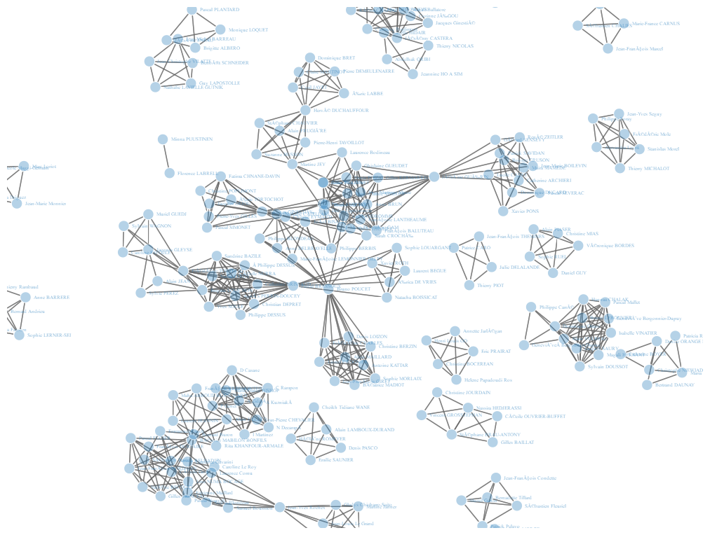<!-- -->

``` r
webshot("Social Network Analysis\\network2.html", "Social Network Analysis\\network2.png", delay = 1)
```

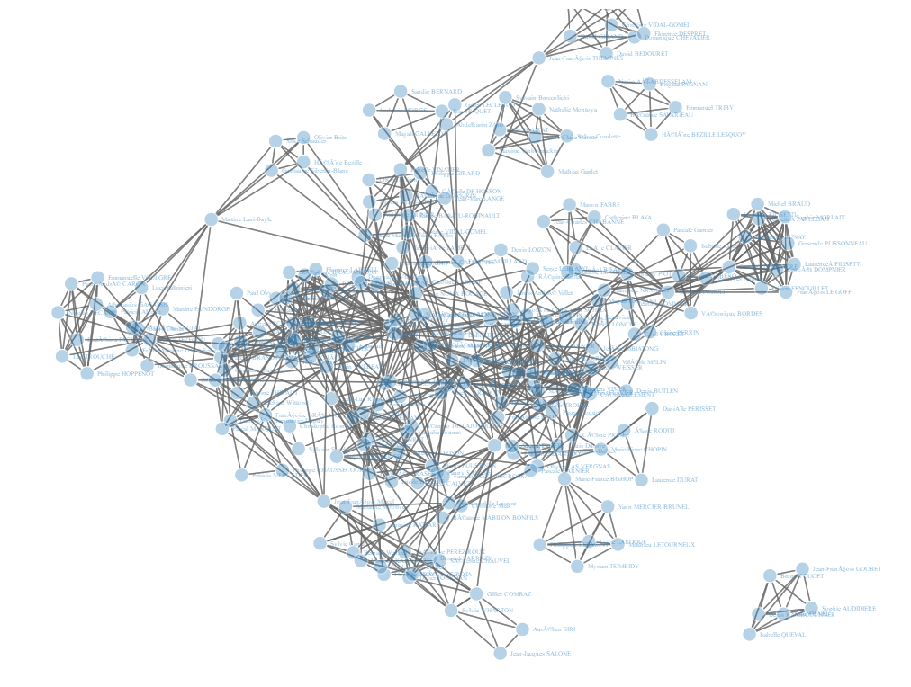<!-- -->

``` r
webshot("Social Network Analysis\\network3.html", "Social Network Analysis\\network3.png", delay = 1)
```

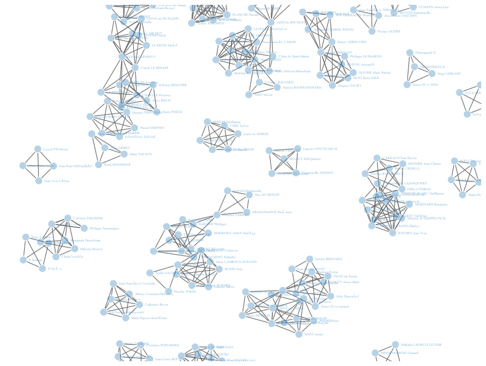<!-- -->

``` r
webshot("Social Network Analysis\\network4.html", "Social Network Analysis\\network4.png", delay = 1)
```

<!-- -->

``` r
webshot("Social Network Analysis\\network5.html", "Social Network Analysis\\network5.png", delay = 1)
```

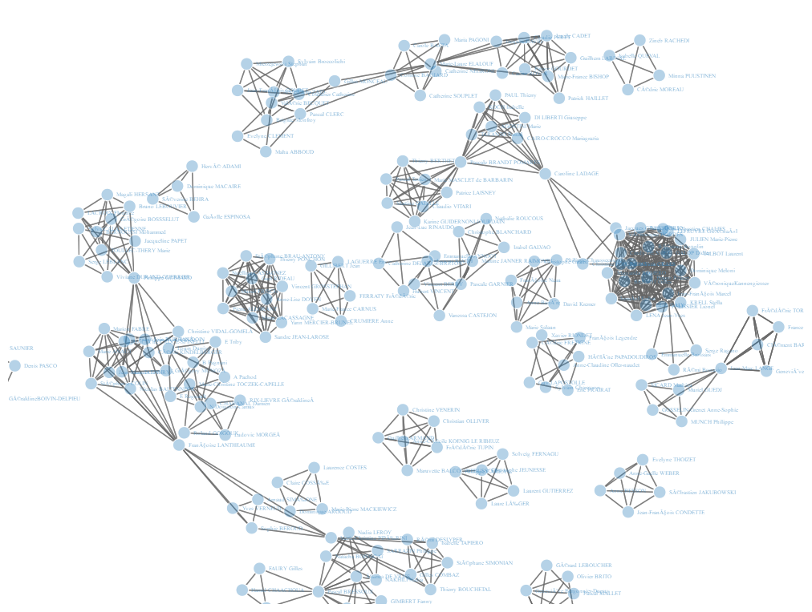<!-- -->

``` r
webshot("Social Network Analysis\\network6.html", "Social Network Analysis\\network6.png", delay = 1)
```

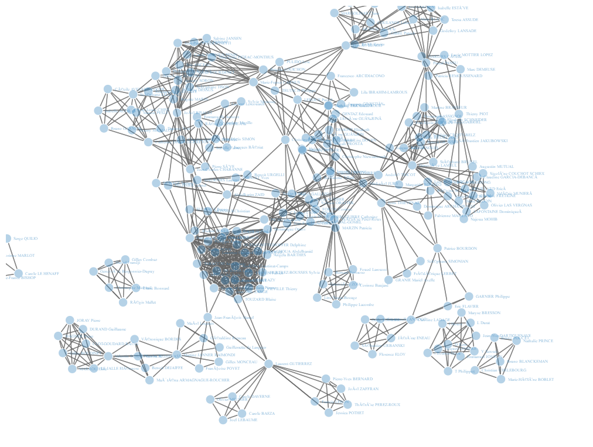<!-- -->

``` r
webshot("Social Network Analysis\\network7.html", "Social Network Analysis\\network7.png", delay = 1)
```

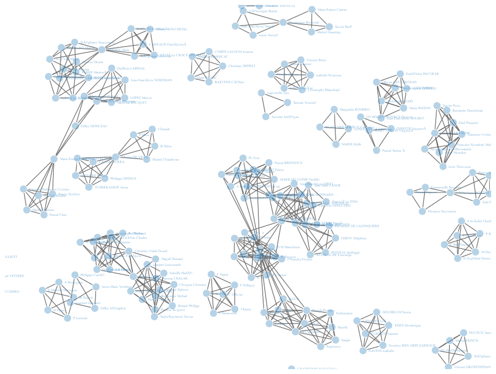<!-- -->

``` r
webshot("Social Network Analysis\\network8.html", "Social Network Analysis\\network8.png", delay = 1)
```

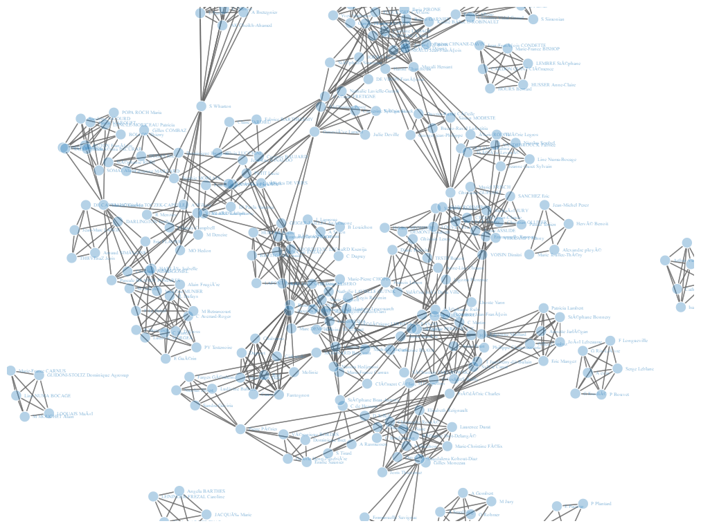<!-- -->

``` r
# Plotting a network using iGraph
graph = graph_from_edgelist(data.matrix(audit_sub6_edge), directed = FALSE)
igraph.options(vertex.size=7)
plot(graph, vertex.label = '')
```

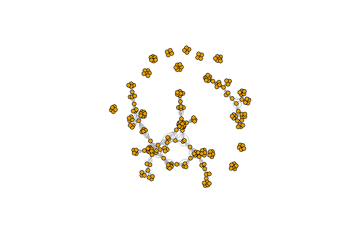<!-- -->

``` r
saveWidget(visIgraph(graph), file = 'Social Network Analysis\\graph.html')
```

``` r
# Detecting and plotting communities
lc <- cluster_louvain(graph)
membership(lc)
```

    ##   [1]  1  2  2  3  1  3  4  1  4  5  6  7  8  9 10 11  1 12 12  3 13  6  1 11 14
    ##  [26]  6 14  7  6  9 15  3 16 13 16 17  1 18  6  3 14  2 15 19 12 19  6 11 10  3
    ##  [51] 12 17  7 20 19 15  3  1  9 18  3 10 10 21  2 11 22  8 18  5 21  3 13 11 18
    ##  [76]  2 13  4  1 18  1 12 13 11  6 10 13 16 10  1  4  9 18 19 11 12  1  7 10 19
    ## [101] 10  1  2 13  3 10  1  2 13 12  3 20 20  3  6  2  8 13 18 13 11  8 11 13 22
    ## [126]  6  2 10  6  3 13 22  9  7 16 13 16 16 10 13 11 20 11  3 12 16  8 10 11 13
    ## [151] 12 13  2 11  9 10 10  1 11  2  4 21  9 11  7 13 17 13 14  6 13 10 11 10 13
    ## [176] 22  1  1  1  3  1  9 10 14  4 18  9 16  2  5  3 18  9  3  2 13 21 12  3  1
    ## [201]  1 16  6  2 18 19  6 11 18 13  1 17  9  3 11 11  6 13 13  1  2  5  8 20  3
    ## [226]  2  2 12 16 21  9  3 10 11 10  7  3 10  6  1 15 20

``` r
communities(lc)
```

    ## $`1`
    ##  [1]   1   5   8  17  23  37  58  79  81  90  97 102 107 158 177 178 179 181 200
    ## [20] 201 211 220 240
    ## 
    ## $`2`
    ##  [1]   2   3  42  65  76 103 108 116 127 153 160 189 195 204 221 226 227
    ## 
    ## $`3`
    ##  [1]   4   6  20  32  40  50  57  61  72 105 111 114 130 144 180 191 194 199 214
    ## [20] 225 232 237
    ## 
    ## $`4`
    ## [1]   7   9  78  91 161 185
    ## 
    ## $`5`
    ## [1]  10  70 190 222
    ## 
    ## $`6`
    ##  [1]  11  22  26  29  39  47  85 115 126 129 170 203 207 217 239
    ## 
    ## $`7`
    ## [1]  12  28  53  98 134 165 236
    ## 
    ## $`8`
    ## [1]  13  68 117 122 147 223
    ## 
    ## $`9`
    ##  [1]  14  30  59  92 133 155 163 182 187 193 213 231
    ## 
    ## $`10`
    ##  [1]  15  49  62  63  86  89  99 101 106 128 139 148 156 157 172 174 183 233 235
    ## [20] 238
    ## 
    ## $`11`
    ##  [1]  16  24  48  66  74  84  95 121 123 141 143 149 154 159 164 173 208 215 216
    ## [20] 234
    ## 
    ## $`12`
    ##  [1]  18  19  45  51  82  96 110 145 151 198 228
    ## 
    ## $`13`
    ##  [1]  21  34  73  77  83  87 104 109 118 120 124 131 136 140 150 152 166 168 171
    ## [20] 175 196 210 218 219
    ## 
    ## $`14`
    ## [1]  25  27  41 169 184
    ## 
    ## $`15`
    ## [1]  31  43  56 241
    ## 
    ## $`16`
    ##  [1]  33  35  88 135 137 138 146 188 202 229
    ## 
    ## $`17`
    ## [1]  36  52 167 212
    ## 
    ## $`18`
    ##  [1]  38  60  69  75  80  93 119 186 192 205 209
    ## 
    ## $`19`
    ## [1]  44  46  55  94 100 206
    ## 
    ## $`20`
    ## [1]  54 112 113 142 224 242
    ## 
    ## $`21`
    ## [1]  64  71 162 197 230
    ## 
    ## $`22`
    ## [1]  67 125 132 176

``` r
plot(lc, graph, vertex.label = '')
```

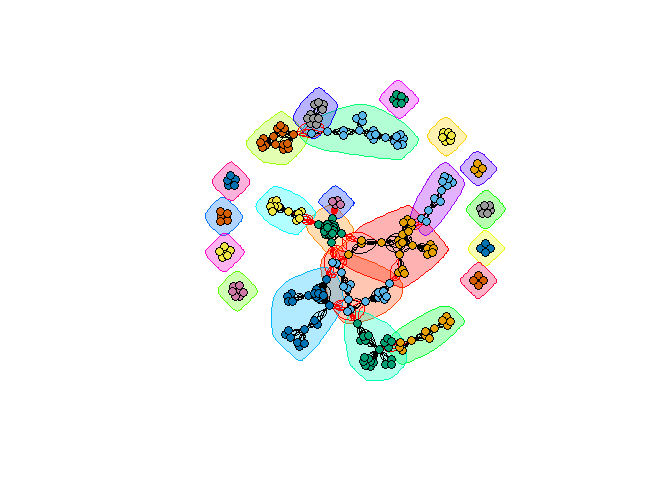<!-- -->

``` r
# Network of all externals
audit_sub9 = filter(audit, status == 'externe')

audit_sub9_edge <- audit_sub9 %>%
  select(n_poste, Name) %>%
  inner_join(., select(., n_poste, Name), by = "n_poste") %>%
  rename(name1 = Name.x, name2 = Name.y) %>%
  filter(name1 != name2) %>%
  unique %>%
  arrange(n_poste) %>%
  select(2,3)

network9 = simpleNetwork(audit_sub9_edge)
saveNetwork(network9,'Social Network Analysis\\network9.html')
webshot("Social Network Analysis\\network9.html", "Social Network Analysis\\network9.png", delay = 1)
```

<!-- -->

``` r
# Top values of degree
Degree <- degree(graph)
head(sort(Degree, decreasing = TRUE), n = 10)
```

    ##  [1] 58 52 52 50 46 42 42 42 42 42

``` r
# Top values of strength
Strength <- strength(graph)
head(sort(Strength, decreasing = TRUE), n = 10)
```

    ##  [1] 58 52 52 50 46 42 42 42 42 42

``` r
# Top values of betweenness
Betweenness <- betweenness(graph)
head(sort(Betweenness, decreasing = TRUE), n = 10)
```

    ##  [1] 3472.000 3271.000 2701.817 2500.400 2328.817 2015.033 1882.167 1706.000
    ##  [9] 1595.367 1585.200

``` r
plot(graph, vertex.label = '', edge.width = Degree)
```

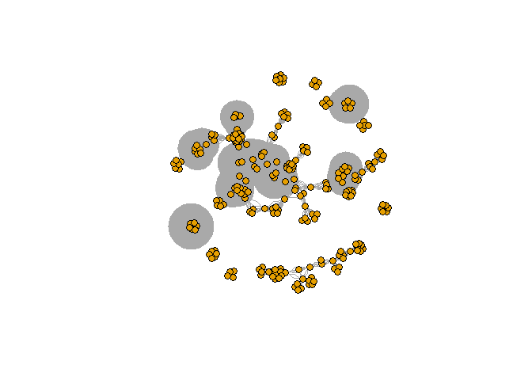<!-- -->

``` r
plot(graph, vertex.label = '', edge.width = Strength)
```

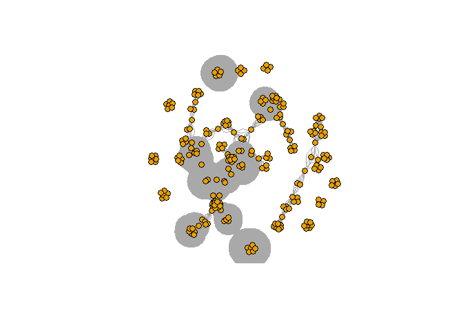<!-- -->

``` r
plot(graph, vertex.label = '', edge.width = Betweenness/50)
```

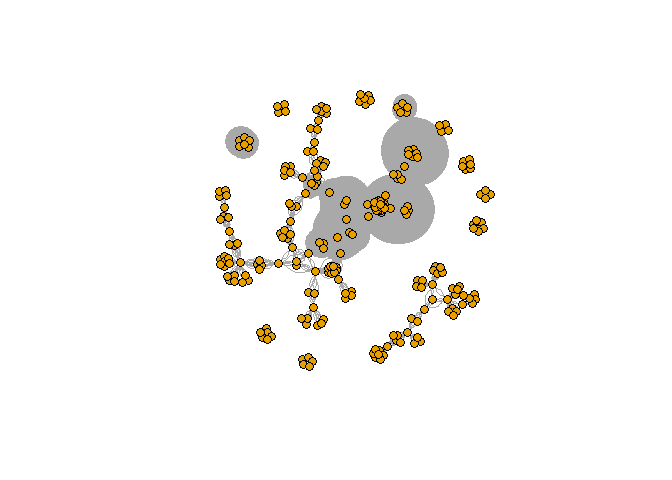<!-- -->

``` r
# Making a chord diagram of the CY-Tech students' movement
png("Social Network Analysis\\chord.png")
school <- c('CY Tech','CY Tech','CY Tech','CY Tech','CY Tech','CY Tech','CY Tech','CY Tech','CY Tech','CY Tech','CY Tech','CY Tech','CY Tech','Howest','Gothenburg','Singidunum','Singidunum')
student <- c('Sarvesh','Neha','Amr','Khushi','Anh Thu','Yasmine','Buu','Maxime','Gabriel','Aya','Maxime','Rodolphe','Gwénaëlle','Casper','Andreas','Zuk','Johann')
university <- c('Gothenburg','Gothenburg','Gothenburg','Gothenburg','Gothenburg','Howest','Howest','Howest','Howest','Howest','Reutlingen','Reutlingen','VUB','CY Tech','CY Tech','CY Tech','CY Tech')
data <- data.frame(student, university)
adjacencyData <- with(data, table(school, university))
chordDiagram(adjacencyData, transparency = 0.5)
dev.off()
```

    ## png 
    ##   2
