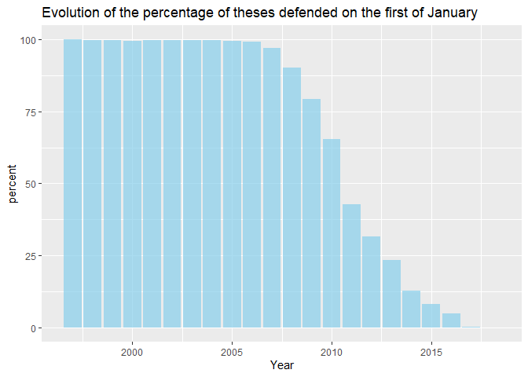
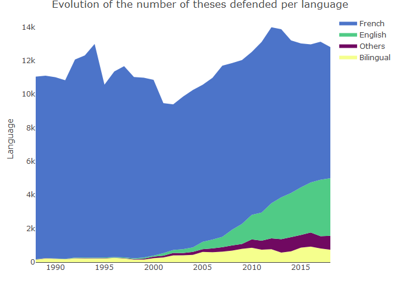

Data Wrangling Report - Code Section
================
CINQUANTA Octave
Dec 2021

## Scraping

``` python
# Importing libraries
from bs4 import BeautifulSoup
import requests
from lxml import etree
import re
import pandas as pd
```

The URL Scraper:

``` python
# Setting the variables to be used in the scraper
next_page = ''
df = pd.DataFrame()
page_number = 2     # This variable determines the number of pages to be scraped
```

``` python
# Looping through the pages to scrap
for k in range(page_number):
    # Collecting the page using the general URL and the suffix obtained below 
    page = requests.get('https://theses.fr/fr/?q='+re.sub("'","",next_page))    
    # Treating the page using Beautiful Soup and lxml
    soup = BeautifulSoup(page.text, 'html.parser')
    dom = etree.HTML(str(soup))
    # Setting the correct x-path and some useful variables
    X_path_url = '//*[@id="resultat"]/div[1]/div[1]/h2/a'
    j = 1
    links = []
    # Looping through the theses to scrap
    for i in range(10):
        # Using the x-path to select the thesis' link and store it in an array
        links.append('https://theses.fr'+dom.xpath(X_path_url)[0].get('href'))
        j = j+3
        # Changing the x-path to the one of the next thesis
        X_path_url = '//*[@id="resultat"]/div['+str(j)+']/div[1]/h2/a'
    # Obtaining the URL suffix of the next page and treating it with regex
    next_page_raw = dom.xpath('//*[@id="pagination"]/a[13]')[0].get('href')
    next_page = re.search('(\'(.*?)\')',next_page_raw).group(1)
    # Storing the obtained links in the data frame
    df = df.append(links)
    print('scraping page '+str(k+1)+'/'+str(page_number))
```

    ## scraping page 1/2
    ## scraping page 2/2

``` python
# Exporting the links to a csv file
df.to_csv('url.csv')
```

The Author Scraper:

``` python
# Setting up the new data frame
df2 = pd.DataFrame()
```

``` python
for k in range(len(df)):
    # Collecting and treating the page, as well as setting up a variable
    page = requests.get(df.iloc[k,0])
    soup = BeautifulSoup(page.text, 'html.parser')
    dom = etree.HTML(str(soup))
    authors = []
    # There are two potential x-paths for the author
    # So the scraper has to try both the first one and use the second one if necessary
    try:
        authors.append(dom.xpath('//*[@id="ficheTitre"]/div[2]/h2/span')[0].text)
    except IndexError:
        authors.append(dom.xpath('//*[@id="ficheTitre"]/div[2]/h2/a/span')[0].text)
    # Storing the obtained author names in the new data frame
    df2 = df2.append(authors)
    print('scraping author '+str(k+1)+'/'+str(len(df)))
```

    ## scraping author 1/20
    ## scraping author 2/20
    ## scraping author 3/20
    ## scraping author 4/20
    ## scraping author 5/20
    ## scraping author 6/20
    ## scraping author 7/20
    ## scraping author 8/20
    ## scraping author 9/20
    ## scraping author 10/20
    ## scraping author 11/20
    ## scraping author 12/20
    ## scraping author 13/20
    ## scraping author 14/20
    ## scraping author 15/20
    ## scraping author 16/20
    ## scraping author 17/20
    ## scraping author 18/20
    ## scraping author 19/20
    ## scraping author 20/20

``` python
# Removing the duplicate authors
df2 = df2.drop_duplicates()
# Exporting the authors to a csv file
df2.to_csv('authors.csv')
```

## Setting up the R environment

``` r
# Setting the working directory
knitr::opts_knit$set(root.dir = "C:/Users/eleoc/Desktop/WORK/Y3S1")
```

``` r
# Loading libraries
library(dplyr)
library(lubridate)
library(ggplot2)
library(hrbrthemes)
library(viridis)
library(naniar)
library(questionr)
library(missForest)
library(xtable)
library(stringr)
library(plotly)
```

``` r
# Preparing a cleaner
rm(list=ls())
```

## Missing Data

``` r
# Importing the data-set
theses <- read.csv('Data Wrangling\\theses_v2.csv',header=T, na.strings=c(""," ","NA"))
```

``` r
# Plotting the missing data
vis_miss(theses,warn_large_data = FALSE) + 
  labs(title = "Missingness of the theses data")
```

<!-- -->

``` r
# Creating a table of the missing data
freq.na(theses)
```

    ##                                          missing  %
    ## Date.de.premiere.inscription.en.doctorat  383668 86
    ## Identifiant.auteur                        129989 29
    ## Langue.de.la.these                         63765 14
    ## Date.de.soutenance                         56746 13
    ## Year                                       56746 13
    ## Identifiant.etablissement                  17085  4
    ## Mise.a.jour.dans.theses.fr                   177  0
    ## Directeur.de.these                            17  0
    ## Directeur.de.these..nom.prenom.               17  0
    ## Titre                                          9  0
    ## Discipline                                     5  0
    ## Etablissement.de.soutenance                    4  0
    ## Auteur                                         2  0
    ## Identifiant.directeur                          0  0
    ## Statut                                         0  0
    ## Identifiant.de.la.these                        0  0
    ## Accessible.en.ligne                            0  0
    ## Publication.dans.theses.fr                     0  0

``` r
# Creating normally distributed array of number of pages, with 20% of missing values
pages <- matrix(rnorm(447644,200,50), 447644, 1) %>%
  prodNA(noNA = 0.2)
# Imputing the missing values with the column mean
pages[is.na(pages)] <- mean(pages,na.rm=TRUE)
# Rounding the values
pages <- round(pages)
# Inserting the column into the main data frame
theses$n.pages <- pages
```

## Common Issues

``` r
# Formatting the defense dates
theses$Date.de.soutenance <- as.Date(theses$Date.de.soutenance,format='%d-%m-%Y')
# Creating two new columns corresponding to the day and month of defense
theses <- theses %>%
  mutate(Month = month(Date.de.soutenance)) %>%
  mutate(Day = day(Date.de.soutenance))
```

``` r
# Counting the number of theses defended on the first of January
theses %>%
  filter(Month == 1 & Day == 1) %>%
  count(Month,Year) %>%
  colSums()
```

    ##  Month   Year      n 
    ##     42  83868 281012

``` r
# Obtaining the percentage of thesis defended on the first of January
(281012/447644)*100
```

    ## [1] 62.77578

``` r
# Counting the number of theses not defended on the first of January per month
monthly_normal <- theses %>%
  filter(!(Month == 1 & Day == 1)) %>%
  count(Month,Year)
# Resuming this data per year
monthly_sum <- aggregate(monthly_normal$n,by=list(monthly_normal$Year), FUN=sum)
```

``` r
# Counting the number of theses defended on the first of January per month
monthly11 <- theses %>%
  filter(Month == 1 & Day == 1) %>%
  count(Month,Year)
```

``` r
# Renaming the Year column properly
names(monthly_sum)[names(monthly_sum) == 'Group.1'] <- 'Year'
```

``` r
# Dropping the useless month column
monthly11 <- select(monthly11,2,3)
```

``` r
# Merging the two data-sets to compare them
january <- merge(monthly_sum, monthly11, by = 'Year')
```

``` r
# Computing the percentage of thesis defended on the first of January
january$percent <- (january$n/(january$n+january$x))*100
```

``` r
# Plotting the data
ggplot(january) +
  geom_bar(aes(x=Year, y=percent), stat="identity", fill="skyblue", alpha=0.7) + 
  labs(title = "Evolution of the percentage of theses defended on the first of January")
```

<!-- -->

``` r
# Filtering out people having defended more than one thesis
unique_author_ID <- theses %>%
  filter(!duplicated(Identifiant.auteur))
# Obtaining the number of name homonyms
sum(duplicated(unique_author_ID$Auteur))
```

    ## [1] 9091

``` r
# Computing the percentage of name homonyms
(9091/447644)*100
```

    ## [1] 2.030855

``` r
# Looking for the Cecile Martin
theses %>%
  filter(Auteur == 'Cecile Martin' & Identifiant.auteur == '81323557')
```

    ##          Auteur Identifiant.auteur
    ## 1 Cecile Martin           81323557
    ## 2 Cecile Martin           81323557
    ## 3 Cecile Martin           81323557
    ## 4 Cecile Martin           81323557
    ##                                                                                                                                                                                   Titre
    ## 1                    Systeme laitier et filiere lait au mexique : contraintes de developpement, strategies d'acteurs, enjeux de leur coevolution. cas de la cienega de chapala, jalisco
    ## 2                                                              Modelisation et criteres de combustibilite en incineration combinee de dechets menagers et de dechets industriels banals
    ## 3 Caracterisation electrophysiologique et pharmacologique des canaux ioniques : sodium, calcium, actives par l'ATP, des cellules myometriales, effets de la gestation et de l'ocytocine
    ## 4                                Influence du ph ruminal sur la digestion des parois vegetales, en relation avec les modifications de l'activite fibrolytique de l'ecosysteme microbien
    ##   Directeur.de.these Directeur.de.these..nom.prenom. Identifiant.directeur
    ## 1     JEAN LOSSOUARN                  LOSSOUARN JEAN                    na
    ## 2    Gerard Antonini                 Antonini Gerard              32192800
    ## 3     Jean Mironneau                  Mironneau Jean              95278966
    ## 4        Yves Briand                     Briand Yves              91232910
    ##                   Etablissement.de.soutenance Identifiant.etablissement
    ## 1 Institut national agronomique Paris-Grignon                  26387859
    ## 2                                   Compiegne                  26570564
    ## 3                                  Bordeaux 2                  26403005
    ## 4                          Clermont-Ferrand 2                  26403102
    ##                                                             Discipline   Statut
    ## 1 Sciences biologiques fondamentales et appliquees. Sciences medicales soutenue
    ## 2                                       Genie des procedes industriels soutenue
    ## 3                                                        Neurosciences soutenue
    ## 4        Sciences biologiques et fondamentales appliquees. Psychologie soutenue
    ##   Date.de.premiere.inscription.en.doctorat Date.de.soutenance Year
    ## 1                                     <NA>         0000-01-01 2000
    ## 2                                     <NA>         0001-01-01 2001
    ## 3                                     <NA>         0091-01-01 1991
    ## 4                                     <NA>         0094-01-01 1994
    ##   Langue.de.la.these Identifiant.de.la.these Accessible.en.ligne
    ## 1                 fr            2000INAP0034                 non
    ## 2                 fr            2001COMP1380                 non
    ## 3                 fr            1991BOR22005                 non
    ## 4                 fr            1994CLF21651                 non
    ##   Publication.dans.theses.fr Mise.a.jour.dans.theses.fr n.pages Month Day
    ## 1                   08-07-17                   10-12-19     229     1   1
    ## 2                   24-05-13                   08-07-20     218     1   1
    ## 3                   24-05-13                   07-07-20     297     1   1
    ## 4                   24-05-13                   07-07-20     159     1   1

``` r
# Looking up the types of Identifiant.directeur
table(sapply(theses$Identifiant.directeur, class))
```

    ## 
    ## character 
    ##    447644

``` r
# Looking up the number of director IDs containing commas
(sum(str_count(theses$Identifiant.directeur,",") != 0))/2
```

    ## [1] 29554

``` r
# Computing the percentage of director IDs containing commas
(29554/447644)*100
```

    ## [1] 6.602121

## Outliers

``` r
# Creating a data frame with the frequency of directors
directors <- as.data.frame(table(theses$Directeur.de.these))
# Renaming its columns
directors <- directors %>%
  rename(Name = Var1, n = Freq)
```

``` r
# Looking at the directors that directed a lot of theses
directors %>%
  filter(n >= 100)
```

    ##                          Name   n
    ## 1             Bernard Teyssie 146
    ## 2               Bruno Foucart 137
    ## 3        Daniel-Henri Pageaux 120
    ## 4  Directeur de these inconnu 713
    ## 5               Eliane Chiron 102
    ## 6               Francis Balle 108
    ## 7         Francois-Paul Blanc 201
    ## 8             Georges Molinie 113
    ## 9            Gregoire Loiseau 102
    ## 10                Guy Pujolle 172
    ## 11            Henry de Lumley 132
    ## 12       Jean-Claude Chaumeil 131
    ## 13     Jean-Michel Scherrmann 208
    ## 14              Jean Bessiere 110
    ## 15            Michel Bertucat 173
    ## 16           Michel Maffesoli 128
    ## 17        Philippe Delebecque 185
    ## 18              Pierre Brunel 197
    ## 19             Roger G. Boulu 127

``` r
# Creating a data frame with the frequency of authors
authors <- as.data.frame(table(theses$Auteur))
# Renaming its columns
authors <- authors %>%
  rename(Name = Var1, n = Freq)
```

``` r
# Looking at the authors that defended a lot of theses
authors %>%
  filter(n >= 10)
```

    ##               Name  n
    ## 1     Bruno Martin 10
    ## 2    Celine Martin 11
    ## 3    Franck Martin 12
    ## 4        Jing Wang 11
    ## 5   Laurent Martin 11
    ## 6   Mamadou Diallo 10
    ## 7  Nathalie Martin 10
    ## 8   Nicolas Martin 16
    ## 9  Olivier Bernard 10
    ## 10  Olivier Martin 11
    ## 11   Pascal Martin 10
    ## 12  Philippe Blanc 10
    ## 13 Philippe Martin 12
    ## 14 Philippe Michel 13
    ## 15 Philippe Robert 10
    ## 16   Philippe Roux 10
    ## 17   Pierre Martin 11
    ## 18  Thierry Martin 10
    ## 19        Yan Wang 10
    ## 20        Yang Liu 12
    ## 21         Yu Wang 10

``` r
# Looking for early career scientists
theses %>%
  filter(Auteur == 'Philippe Michel' & Identifiant.auteur == '83251103')
```

    ##            Auteur Identifiant.auteur
    ## 1 Philippe Michel           83251103
    ## 2 Philippe Michel           83251103
    ## 3 Philippe Michel           83251103
    ## 4 Philippe Michel           83251103
    ## 5 Philippe Michel           83251103
    ##                                                                                                                                Titre
    ## 1                                           De quelques aspects de sante tropicale au sud soudan : rapport d'une mission humanitaire
    ## 2                                                                                                Autour des conjectures de sato-tate
    ## 3                                                        Etude nosographique, epidemiologique et economique de la migraine en France
    ## 4                         Analyse de la prise en charge d'un cas de psychose chronique : reflexion sur une therapie institutionnelle
    ## 5 Modification chimique de la lignine : synthese radicalaire et caracterisation de copolymeres, lignine beta methacrylate de methyle
    ##        Directeur.de.these Directeur.de.these..nom.prenom. Identifiant.directeur
    ## 1         PHILIPPE CANTON                 CANTON PHILIPPE                    na
    ## 2          Etienne Fouvry                  Fouvry Etienne              83861688
    ## 3 Jean-Francois Dartigues         Dartigues Jean-Francois              58586105
    ## 4        Jean-Louis Terra                Terra Jean-Louis              34152733
    ## 5  Jean-Jacques Villenave          Villenave Jean-Jacques              60384360
    ##   Etablissement.de.soutenance Identifiant.etablissement
    ## 1                     Nancy 1                  26403390
    ## 2                    Paris 11                  26404664
    ## 3                  Bordeaux 2                      <NA>
    ## 4                      Lyon 1                      <NA>
    ## 5                  Bordeaux 1                  27548341
    ##                        Discipline   Statut
    ## 1                        Medecine soutenue
    ## 2 Sciences et techniques communes soutenue
    ## 3                        Medecine soutenue
    ## 4                        Medecine soutenue
    ## 5  Chimie des materiaux polymeres soutenue
    ##   Date.de.premiere.inscription.en.doctorat Date.de.soutenance Year
    ## 1                                     <NA>         0094-01-01 1994
    ## 2                                     <NA>         0095-01-01 1995
    ## 3                                     <NA>         0091-01-01 1991
    ## 4                                     <NA>         0091-01-01 1991
    ## 5                                     <NA>         0089-01-01 1989
    ##   Langue.de.la.these Identifiant.de.la.these Accessible.en.ligne
    ## 1                 fr            1994NAN11151                 non
    ## 2                 fr            1995PA112016                 non
    ## 3                 fr            1991BOR23053                 non
    ## 4                 fr            1991LYO1M060                 non
    ## 5                 fr            1989BOR10592                 non
    ##   Publication.dans.theses.fr Mise.a.jour.dans.theses.fr n.pages Month Day
    ## 1                   24-05-13                   13-12-18     185     1   1
    ## 2                   24-05-13                   08-04-19     184     1   1
    ## 3                   24-05-13                   10-04-19     200     1   1
    ## 4                   24-05-13                   11-12-19     215     1   1
    ## 5                   24-05-13                   07-07-20     215     1   1

## Preliminary Results

``` r
# Renaming the languages column
theses <- theses %>%
  rename(langage = Langue.de.la.these)
```

``` r
# Counting the languages
langages <- theses %>%
  count(langage,Year) %>%
  mutate(langage = case_when(langage == 'fr' ~ 'french', langage == 'en' ~ 'english',
                             langage == 'fren' | langage == 'enfr' ~ 'bilingual',
                             TRUE ~ 'others')) %>%
  group_by(langage,Year) %>%
  summarise(n = sum(n))
```

``` r
# Removing the useless years
langages <- langages %>%
  filter(Year >= 1988 & Year <= 2018)
```

``` r
# Plotting the data using ggplot
ggplot(langages, aes(x=Year, y=n, 
                     fill=factor(langage, 
                                 levels = c('french','bilingual','others','english')))) + 
  geom_area(position = position_stack(reverse = TRUE)) +
  labs(fill='Language') +
  scale_fill_viridis_d() + 
  labs(title = "Evolution of the number of theses defended per language")
```

<!-- -->

``` r
# Creating a variable per language 
lang_bilingual <- subset(langages,langage == 'bilingual')
lang_french <- subset(langages,langage == 'french')
lang_english <- subset(langages,langage == 'english')
lang_others <- subset(langages,langage == 'others')
```

``` r
# Creating a new language variable for use of plotly
langages2 <- lang_bilingual[2]
langages2 <- langages2 %>%
  mutate(bilingual = lang_bilingual$n,french = lang_french$n,
         english = lang_english$n,others = lang_others$n)
```

``` r
# Plotting the data using plotly
fig <- plot_ly(langages2, x = ~Year, y = ~bilingual, 
               name = 'Bilingual', type = 'scatter', 
               mode = 'none', stackgroup = 'one', fillcolor = '#F5FF8D')
fig <- fig %>% add_trace(y = ~others, name = 'Others', fillcolor = '#700961')
fig <- fig %>% add_trace(y = ~english, name = 'English', fillcolor = '#50CB86')
fig <- fig %>% add_trace(y = ~french, name = 'French', fillcolor = '#4C74C9')
fig <- fig %>% layout(title = 'Evolution of the number of theses defended per language',
         xaxis = list(title = "",
                      showgrid = FALSE),
         yaxis = list(title = "Language",
                      showgrid = FALSE))
fig
```

<!-- -->

``` r
# Obtaining the monthly amount of theses
monthly <- theses %>%
  filter(!(Month == 1 & Day == 1)) %>%
  count(Month,Year)
```

``` r
# Removing the useless years
monthly <- monthly %>%
  filter(Year >= 2013 & Year != 2020)
```

``` r
# Computing the yearly percentages
monthly <- monthly %>%
  group_by(Year) %>% 
  mutate(percent = n/sum(n)*100)
```

``` r
# Obtaining the means and standard deviations of those percentages
monthly <- monthly %>%
  group_by(Month) %>%
  mutate(mean = mean(percent)) %>%
  mutate(sd = sd(percent))
```

``` r
# Collecting the data in a simpler matrix
superior_monthly <- unique(select(monthly,1,5,6))
```

``` r
# Plotting the data
ggplot(superior_monthly) +
  geom_bar(aes(x=Month, y=mean), stat="identity", fill="skyblue", alpha=0.7) +
  geom_errorbar(aes(x=Month, ymin=mean-sd, ymax=mean+sd), 
                width=0.4, colour="orange", alpha=0.9, size=1.3) + 
  labs(title = "Repartition of the percentage of theses defended per month")
```

<!-- -->
