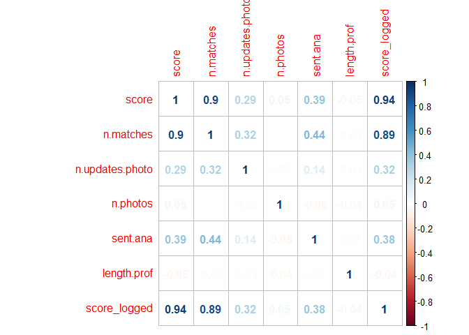
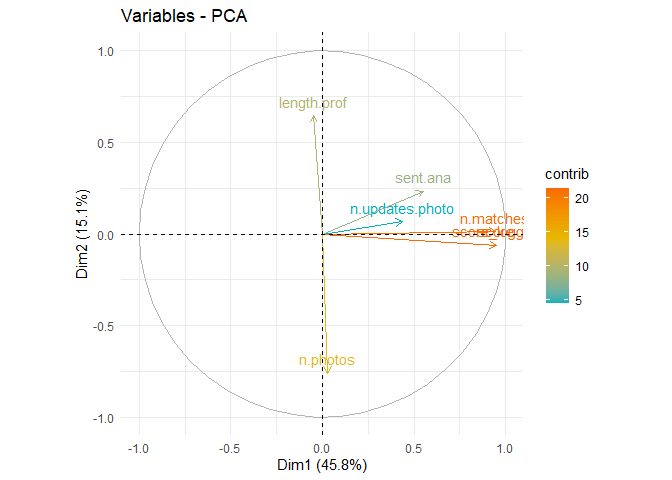
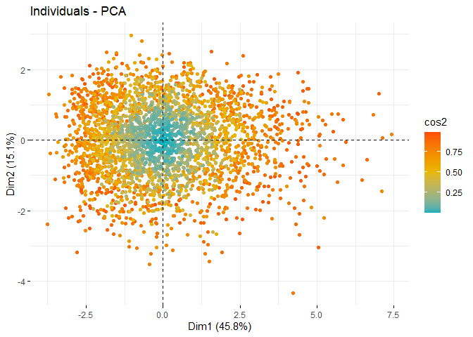
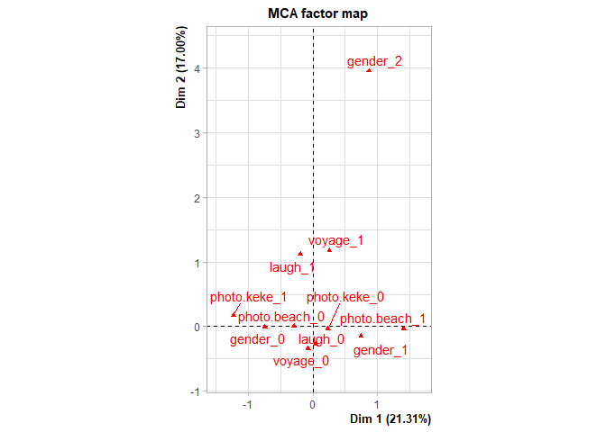
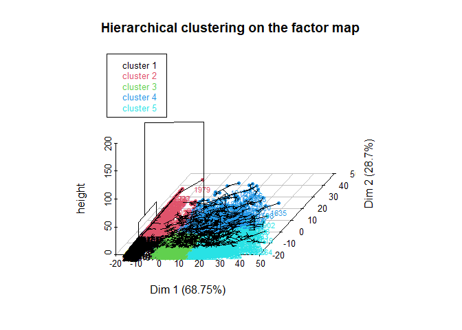
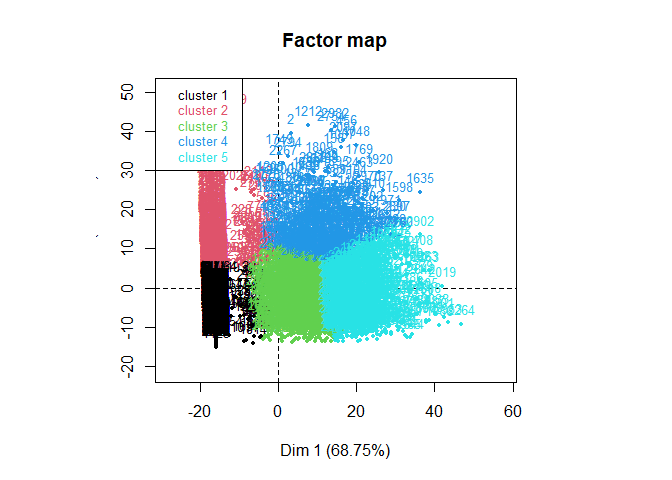
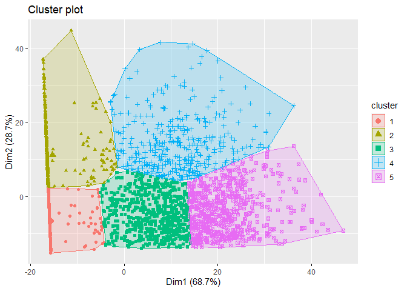
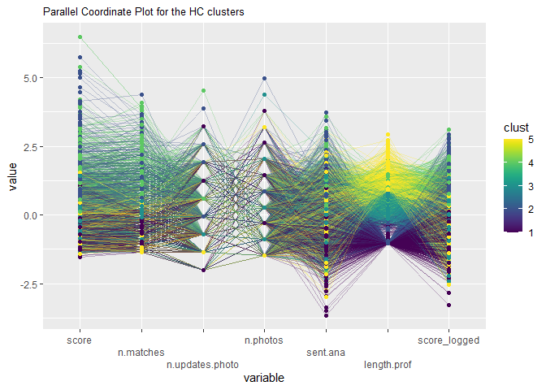

Dimensionality Reduction Report - Code Section
================
CINQUANTA Octave
Dec 2021
 
``` r
# Setting the working directory
knitr::opts_knit$set(root.dir = "C:/Users/eleoc/Desktop/WORK/Y3S1")
```

``` r
# Loading libraries
library(corrplot)
library(gginference)
library(dplyr)
library(ggplot2)
library(factoextra)
library(stats)
library(FactoMineR)
library(GGally)
library(hrbrthemes)
library(viridis)
```

``` r
# Preparing a cleaner
rm(list=ls())
```

## Identifying correlations in the variables

``` r
# Importing data
users = read.csv('Dimensionality Reduction\\users.db.csv')
```

``` r
# Creating a data set of only numeric values of users
users_num <- mutate_all(users, function(x) as.numeric(as.character(x)))
```

    ## Warning in (function (x) : NAs introduced by coercion

    ## Warning in (function (x) : NAs introduced by coercion

    ## Warning in (function (x) : NAs introduced by coercion

``` r
users_num <- select(users_num,-1,-2,-7,-8,-9)
```

``` r
# Adding a variable corresponding to the logged score
users_num$score_logged <- log(users_num$score)
```

``` r
# Removing the categorical variables
users_num2 <- select(users_num,-5,-8,-9,-10,-11)
```

``` r
# Plotting the correlations in users
corrplot(cor(users_num2),method = 'number')
```

<!-- -->

``` r
# Cor test between score and matches
cor.test(users_num2$score, users_num2$n.matches)
```

    ## 
    ##  Pearson's product-moment correlation
    ## 
    ## data:  users_num2$score and users_num2$n.matches
    ## t = 114.44, df = 2998, p-value < 2.2e-16
    ## alternative hypothesis: true correlation is not equal to 0
    ## 95 percent confidence interval:
    ##  0.8951737 0.9085205
    ## sample estimates:
    ##       cor 
    ## 0.9020625

``` r
# Cor test between score logged and matches
cor.test(users_num2$score_logged, users_num2$n.matches)
```

    ## 
    ##  Pearson's product-moment correlation
    ## 
    ## data:  users_num2$score_logged and users_num2$n.matches
    ## t = 105.9, df = 2998, p-value < 2.2e-16
    ## alternative hypothesis: true correlation is not equal to 0
    ## 95 percent confidence interval:
    ##  0.8805031 0.8956149
    ## sample estimates:
    ##       cor 
    ## 0.8882992

``` r
# Cor test between entimental analysis and matches
cor.test(users_num2$sent.ana, users_num2$n.matches)
```

    ## 
    ##  Pearson's product-moment correlation
    ## 
    ## data:  users_num2$sent.ana and users_num2$n.matches
    ## t = 26.887, df = 2998, p-value < 2.2e-16
    ## alternative hypothesis: true correlation is not equal to 0
    ## 95 percent confidence interval:
    ##  0.4114792 0.4691611
    ## sample estimates:
    ##       cor 
    ## 0.4407751

``` r
# Cor test between photo updates and matches
cor.test(users_num2$n.updates.photo, users_num2$n.matches)
```

    ## 
    ##  Pearson's product-moment correlation
    ## 
    ## data:  users_num2$n.updates.photo and users_num2$n.matches
    ## t = 18.521, df = 2998, p-value < 2.2e-16
    ## alternative hypothesis: true correlation is not equal to 0
    ## 95 percent confidence interval:
    ##  0.2879405 0.3521733
    ## sample estimates:
    ##       cor 
    ## 0.3204252

## Dimensionality Reduction

``` r
# PCA of users
PCA <- prcomp(users_num2, scale = TRUE)
PCA$rotation
```

    ##                         PC1         PC2          PC3         PC4        PC5
    ## score            0.53191399 -0.05981388  0.046265887  0.07288421  0.2423494
    ## n.matches        0.52891243  0.01308196  0.009993998  0.06575461  0.1665249
    ## n.updates.photo  0.24418765  0.06647992 -0.154677673 -0.89591953 -0.3290645
    ## n.photos         0.01607191 -0.73750887  0.624649818 -0.07035009 -0.2416298
    ## sent.ana         0.30724643  0.22660163 -0.009410928  0.40707989 -0.8271063
    ## length.prof     -0.02813308  0.62694128  0.762767633 -0.12615476  0.0912881
    ## score_logged     0.53126396 -0.05923331  0.041761002  0.03338005  0.2333011
    ##                          PC6          PC7
    ## score            0.295946091  0.748144264
    ## n.matches       -0.821977360 -0.110813538
    ## n.updates.photo  0.013975612  0.029615721
    ## n.photos        -0.047703560 -0.005023340
    ## sent.ana         0.065861455  0.002470454
    ## length.prof      0.009281706  0.002002602
    ## score_logged     0.479452086 -0.653519764

``` r
# Circle of correlation
fviz_pca_var(PCA, col.var="contrib")+scale_color_gradient2(low="#00AFBB", mid="#E7B800",high="#FC4E07", midpoint=14) +
  theme_minimal()
```

<!-- -->

``` r
# Individual map of PCA
fviz_pca_ind(PCA,col.ind = "cos2",gradient.cols = c("#00AFBB", "#E7B800", "#FC4E07"),repel = TRUE, geom = 'point', select.ind = list(cos2 = 3000))
```

<!-- -->

``` r
# Biplot of PCA
fviz_pca_biplot(PCA,col.ind = "cos2",gradient.cols = c("#00AFBB", "#E7B800", "#FC4E07"),repel = TRUE, geom = 'point', select.ind = list(cos2 = 300))
```

<!-- -->

``` r
# Table of loadings
PCA_in <- princomp(users_num2, scale = TRUE, scores = TRUE)
```

    ## Warning: In princomp.default(users_num2, scale = TRUE, scores = TRUE) :
    ##  extra argument 'scale' will be disregarded

``` r
PCA_in$loadings
```

    ## 
    ## Loadings:
    ##                 Comp.1 Comp.2 Comp.3 Comp.4 Comp.5 Comp.6 Comp.7
    ## score                                               0.914  0.393
    ## n.matches               0.988                      -0.107       
    ## n.updates.photo                              0.997              
    ## n.photos                       0.146  0.986                     
    ## sent.ana                0.101 -0.984  0.145                     
    ## length.prof     -0.999                                          
    ## score_logged                                        0.389 -0.920
    ## 
    ##                Comp.1 Comp.2 Comp.3 Comp.4 Comp.5 Comp.6 Comp.7
    ## SS loadings     1.000  1.000  1.000  1.000  1.000  1.000  1.000
    ## Proportion Var  0.143  0.143  0.143  0.143  0.143  0.143  0.143
    ## Cumulative Var  0.143  0.286  0.429  0.571  0.714  0.857  1.000

``` r
users_cat <- select(users,10,13,14,15,16)
users_cat$gender <- as.factor(users_cat$gender)
users_cat$voyage <- as.factor(users_cat$voyage)
users_cat$laugh <- as.factor(users_cat$laugh)
users_cat$photo.keke <- as.factor(users_cat$photo.keke)
users_cat$photo.beach <- as.factor(users_cat$photo.beach)
MCA <- MCA(users_cat,ncp = 5, graph = TRUE)
```

<!-- --><!-- --><!-- -->

``` r
MCA
```

    ## **Results of the Multiple Correspondence Analysis (MCA)**
    ## The analysis was performed on 3000 individuals, described by 5 variables
    ## *The results are available in the following objects:
    ## 
    ##    name              description                       
    ## 1  "$eig"            "eigenvalues"                     
    ## 2  "$var"            "results for the variables"       
    ## 3  "$var$coord"      "coord. of the categories"        
    ## 4  "$var$cos2"       "cos2 for the categories"         
    ## 5  "$var$contrib"    "contributions of the categories" 
    ## 6  "$var$v.test"     "v-test for the categories"       
    ## 7  "$ind"            "results for the individuals"     
    ## 8  "$ind$coord"      "coord. for the individuals"      
    ## 9  "$ind$cos2"       "cos2 for the individuals"        
    ## 10 "$ind$contrib"    "contributions of the individuals"
    ## 11 "$call"           "intermediate results"            
    ## 12 "$call$marge.col" "weights of columns"              
    ## 13 "$call$marge.li"  "weights of rows"

``` r
# MCA scree plot
fviz_screeplot(MCA)
```

<!-- -->

## k-means and Hierarchical Clustering

``` r
# Scree plot of PCA
fviz_eig(PCA)
```

<!-- -->

``` r
# Scree plot of users_num2
wss <- (nrow(users_num2)-1)*sum(apply(users_num2,2,var))
  for (i in 2:15) wss[i] <- sum(kmeans(users_num2,
                                       centers=i)$withinss)
plot(1:15, wss, type="b", xlab="Number of Clusters",
     ylab="Within groups sum of squares")
```

<!-- -->

``` r
# k-means
k <- kmeans(users_num2,centers = 5)
fviz_cluster(k, data = users_num2, geom="point")
```

<!-- -->

``` r
# Understanding the clusters
users_clustered = users_num2
users_clustered <- users_clustered %>%
  mutate(cluster = k$cluster)
ggparcoord(users_clustered,
    columns = 1:7, groupColumn = 8,
    showPoints = TRUE, 
    title = "Parallel Coordinate Plot for the k-means clusters",
    alphaLines = 0.3
    ) + 
  scale_color_viridis() +
  theme(plot.title = element_text(size=10))+
  scale_x_discrete(guide = guide_axis(n.dodge=3))
```

<!-- -->

``` r
# HCPC
res <- HCPC(users_num2,nb.clust = 5)
```

<!-- --><!-- --><!-- -->

``` r
fviz_cluster(res, geom="point")
```

<!-- -->

``` r
users_clustered2 = res$data.clust
users_clustered2$clust <- as.numeric(users_clustered2$clust)
ggparcoord(users_clustered2,
    columns = 1:7, groupColumn = 8,
    showPoints = TRUE, 
    title = "Parallel Coordinate Plot for the HC clusters",
    alphaLines = 0.3
    ) + 
  scale_color_viridis() +
  theme(plot.title = element_text(size=10))+
  scale_x_discrete(guide = guide_axis(n.dodge=3))
```

<!-- -->
