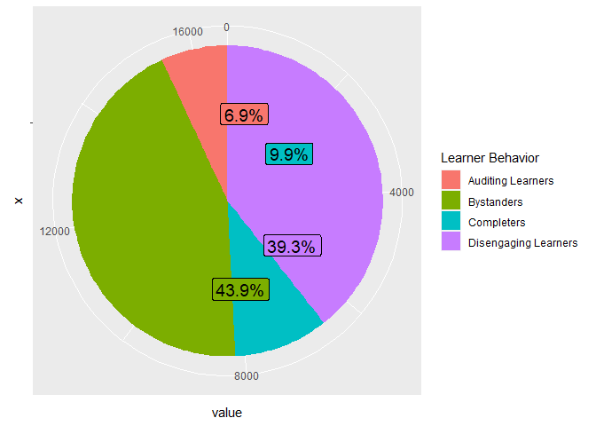
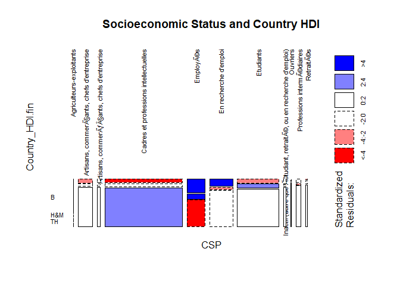
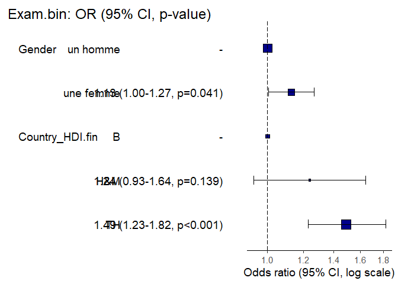
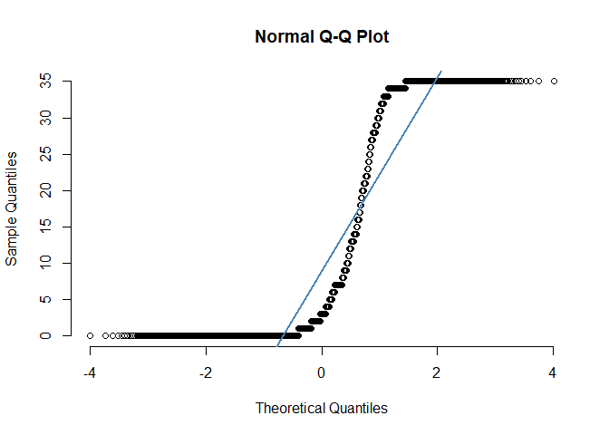

Intermediate Statistics Report - Code Section
================
CINQUANTA Octave
Mar 2022

``` r
# Setting the working directory
knitr::opts_knit$set(root.dir = "C:/Users/eleoc/Desktop/WORK/Y3S1")
```

``` r
# Loading libraries
library(plyr)
library(dplyr)
library(ggplot2)
library(bbplot)
library(ggrepel)
library(forcats)
library(scales)
library(xtable)
library(MASS)
library(caret)
library(leaps)
library(klaR)
library(graphics)
library(questionr)
library(finalfit)
library(moonBook)
library(survival)
library(ranger)
library(ggfortify)
library(survminer)
```

``` r
# Preparing a cleaner
rm(list=ls())
```

``` r
# Importing data
quest1 = read.csv('Intermediate Statistics\\data\\effec1.quest.compil.csv')
quest2 = read.csv('Intermediate Statistics\\data\\effec2.quest.compil.csv')
quest3 = read.csv('Intermediate Statistics\\data\\effec3.quest.compil.csv')
usage1 = read.csv('Intermediate Statistics\\data\\usages.effec1.csv')
usage2 = read.csv('Intermediate Statistics\\data\\usages.effec2.csv')
usage3 = read.csv('Intermediate Statistics\\data\\usages.effec3.csv')
```

``` r
# Adding a column specifying from which file the data comes for quest
quest1$quest1 = 1
quest2$quest2 = 1
quest3$quest3 = 1
usage1$usage1 = 1
usage2$usage2 = 1
usage3$usage3 = 1
```

``` r
# Merging the data sets together
quest_subtotal <- rbind.fill(quest1,quest2)
quest_total <- rbind.fill(quest_subtotal,quest3)
usage_subtotal <- rbind.fill(usage1,usage2)
usage_total <- rbind.fill(usage_subtotal,usage3)
complete_dataset <- rbind.fill(quest_total,usage_total)
```

``` r
# Merging the duplicate IDs
cleaned_dataset <- complete_dataset %>%
  arrange(Student_ID, desc(Student_ID)) %>%
  group_by(Student_ID) %>%
  summarise_all(funs(first(.[!is.na(.)]))) %>%
  ungroup()
```

    ## Warning: `funs()` was deprecated in dplyr 0.8.0.
    ## Please use a list of either functions or lambdas: 
    ## 
    ##   # Simple named list: 
    ##   list(mean = mean, median = median)
    ## 
    ##   # Auto named with `tibble::lst()`: 
    ##   tibble::lst(mean, median)
    ## 
    ##   # Using lambdas
    ##   list(~ mean(., trim = .2), ~ median(., na.rm = TRUE))

``` r
# Isolating the various behaviors
level_completers <- filter(cleaned_dataset,Exam.bin == 1)
level_disengaging_learners <- filter(cleaned_dataset, (Exam.bin == 0 | is.na(Exam.bin) == TRUE) & (Assignment.bin == 1 | Quizz.1.bin == 1 | Quizz.2.bin == 1 | Quizz.3.bin == 1 | Quizz.4.bin == 1 | Quizz.5.bin == 1))
level_auditing_learners <- filter(cleaned_dataset, (Exam.bin == 0 | is.na(Exam.bin) == TRUE) & (Assignment.bin == 0 | is.na(Assignment.bin) == TRUE) & (Quizz.1.bin == 0 | is.na(Quizz.1.bin) == TRUE) & (Quizz.2.bin == 0 | is.na(Quizz.2.bin) == TRUE) & (Quizz.3.bin == 0 | is.na(Quizz.3.bin) == TRUE) & (Quizz.4.bin == 0 | is.na(Quizz.4.bin) == TRUE) & (Quizz.5.bin == 0 | is.na(Quizz.5.bin) == TRUE) & last.video >= 3.5)
level_bystanders <- filter(cleaned_dataset, (Exam.bin == 0 | is.na(Exam.bin) == TRUE) & (Assignment.bin == 0 | is.na(Assignment.bin) == TRUE) & (Quizz.1.bin == 0 | is.na(Quizz.1.bin) == TRUE) & (Quizz.2.bin == 0 | is.na(Quizz.2.bin) == TRUE) & (Quizz.3.bin == 0 | is.na(Quizz.3.bin) == TRUE) & (Quizz.4.bin == 0 | is.na(Quizz.4.bin) == TRUE) & (Quizz.5.bin == 0 | is.na(Quizz.5.bin) == TRUE) & (last.video <= 3.5 | is.na(last.video) == TRUE))
```

``` r
levels_count <- c(nrow(level_completers),nrow(level_disengaging_learners),nrow(level_auditing_learners),nrow(level_bystanders))
levels <- data.frame(group=c('Completers','Disengaging Learners','Auditing Learners','Bystanders'),value=levels_count)
```

``` r
ggplot(levels, aes(x = "", y = value, fill = group)) +
  geom_bar(width = 1, stat = "identity") +
  coord_polar("y") +
  geom_label_repel(aes(label = percent(value / sum(value))), size=5, show.legend = F, position='identity') +
  guides(fill = guide_legend(title = "Learner Behavior"))
```

<!-- -->

``` r
cleaned_dataset$videos <- rowSums(cleaned_dataset[63:97],na.rm=T)
cleaned_dataset <- cleaned_dataset %>%
  group_by(Gender) %>%
  mutate(videos_by_gender = mean(videos))
```

``` r
# T-Test for Gender and videos
lm(videos ~ Gender, data = cleaned_dataset) %>%
  xtable()
```

    ## % latex table generated in R 4.0.5 by xtable 1.8-4 package
    ## % Fri Mar 18 12:39:32 2022
    ## \begin{table}[ht]
    ## \centering
    ## \begin{tabular}{rrrrr}
    ##   \hline
    ##  & Estimate & Std. Error & t value & Pr($>$$|$t$|$) \\ 
    ##   \hline
    ## (Intercept) & 16.4672 & 0.1725 & 95.48 & 0.0000 \\ 
    ##   Genderune femme & 0.9664 & 0.3003 & 3.22 & 0.0013 \\ 
    ##    \hline
    ## \end{tabular}
    ## \end{table}

``` r
cleaned_dataset <- cleaned_dataset %>%
  group_by(Country_HDI.fin) %>%
  mutate(videos_by_HDI = mean(videos))
cleaned_dataset_for_HDI <- cleaned_dataset[!is.na(cleaned_dataset$Country_HDI.fin),]
```

``` r
# ANOVA for Country_HDI.fin and videos
summary(aov(videos ~ Country_HDI.fin, data = cleaned_dataset_for_HDI)) %>%
  xtable()
```

    ## % latex table generated in R 4.0.5 by xtable 1.8-4 package
    ## % Fri Mar 18 12:39:32 2022
    ## \begin{table}[ht]
    ## \centering
    ## \begin{tabular}{lrrrrr}
    ##   \hline
    ##  & Df & Sum Sq & Mean Sq & F value & Pr($>$F) \\ 
    ##   \hline
    ## Country\_HDI.fin & 2 & 83050.72 & 41525.36 & 246.54 & 0.0000 \\ 
    ##   Residuals       & 8776 & 1478160.32 & 168.43 &  &  \\ 
    ##    \hline
    ## \end{tabular}
    ## \end{table}

``` r
# Making an ANOVA table
anova(lm(videos ~ Gender + Country_HDI.fin + CSP, data = cleaned_dataset)) %>%
  xtable()
```

    ## % latex table generated in R 4.0.5 by xtable 1.8-4 package
    ## % Fri Mar 18 12:39:32 2022
    ## \begin{table}[ht]
    ## \centering
    ## \begin{tabular}{lrrrrr}
    ##   \hline
    ##  & Df & Sum Sq & Mean Sq & F value & Pr($>$F) \\ 
    ##   \hline
    ## Gender & 1 & 1669.10 & 1669.10 & 9.96 & 0.0016 \\ 
    ##   Country\_HDI.fin & 2 & 80867.52 & 40433.76 & 241.31 & 0.0000 \\ 
    ##   CSP & 10 & 8466.68 & 846.67 & 5.05 & 0.0000 \\ 
    ##   Residuals & 8730 & 1462817.05 & 167.56 &  &  \\ 
    ##    \hline
    ## \end{tabular}
    ## \end{table}

``` r
# Dealing with age
cleaned_dataset$birth.year <- as.numeric(cleaned_dataset$birth.year)
```

    ## Warning: NAs introduced by coercion

``` r
cleaned_dataset$age = 2014 - cleaned_dataset$birth.year
cleaned_dataset <- cleaned_dataset %>%
  mutate(age = case_when(age < 0 ~ NA_real_, age > 100 ~ NA_real_, TRUE ~ age))
cleaned_dataset <- cleaned_dataset %>%
  mutate(age_class = cut(age,breaks = c(20,30,40,50,60,70,80,90,100)))
```

``` r
# Tukey HSD
TukeyHSD(aov(videos ~ Gender + Country_HDI.fin + CSP + age_class, data = cleaned_dataset))
```

    ##   Tukey multiple comparisons of means
    ##     95% family-wise confidence level
    ## 
    ## Fit: aov(formula = videos ~ Gender + Country_HDI.fin + CSP + age_class, data = cleaned_dataset)
    ## 
    ## $Gender
    ##                         diff       lwr      upr   p adj
    ## une femme-un homme 0.8421027 0.2481633 1.436042 0.00546
    ## 
    ## $Country_HDI.fin
    ##            diff      lwr       upr p adj
    ## H&M-B  4.777333 3.158072  6.396593     0
    ## TH-B   9.085877 8.003857 10.167898     0
    ## TH-H&M 4.308544 2.996215  5.620874     0
    ## 
    ## $CSP
    ##                                                                                                                        diff
    ## Artisans, commerçants, chefs d'entreprise-Agriculteurs-exploitants                                              2.57346160
    ## Artisans, commerçants, chefs d'entreprise-Agriculteurs-exploitants                                            4.71965468
    ## Cadres et professions intellectuelles-Agriculteurs-exploitants                                                   3.81585226
    ## Employés-Agriculteurs-exploitants                                                                               3.47817719
    ## En recherche d'emploi-Agriculteurs-exploitants                                                                   5.14237411
    ## Etudiants-Agriculteurs-exploitants                                                                               2.32219070
    ## Inactif (autre que étudiant, retraité, ou en recherche d'emploi)-Agriculteurs-exploitants                      6.46708781
    ## Ouvriers-Agriculteurs-exploitants                                                                                5.45466900
    ## Professions intermédiaires-Agriculteurs-exploitants                                                             1.80258419
    ## Retraités-Agriculteurs-exploitants                                                                              6.55856866
    ## Artisans, commerçants, chefs d'entreprise-Artisans, commerçants, chefs d'entreprise                          2.14619308
    ## Cadres et professions intellectuelles-Artisans, commerçants, chefs d'entreprise                                 1.24239066
    ## Employés-Artisans, commerçants, chefs d'entreprise                                                             0.90471558
    ## En recherche d'emploi-Artisans, commerçants, chefs d'entreprise                                                 2.56891251
    ## Etudiants-Artisans, commerçants, chefs d'entreprise                                                            -0.25127090
    ## Inactif (autre que étudiant, retraité, ou en recherche d'emploi)-Artisans, commerçants, chefs d'entreprise    3.89362621
    ## Ouvriers-Artisans, commerçants, chefs d'entreprise                                                              2.88120740
    ## Professions intermédiaires-Artisans, commerçants, chefs d'entreprise                                          -0.77087741
    ## Retraités-Artisans, commerçants, chefs d'entreprise                                                            3.98510706
    ## Cadres et professions intellectuelles-Artisans, commerçants, chefs d'entreprise                              -0.90380242
    ## Employés-Artisans, commerçants, chefs d'entreprise                                                          -1.24147750
    ## En recherche d'emploi-Artisans, commerçants, chefs d'entreprise                                               0.42271943
    ## Etudiants-Artisans, commerçants, chefs d'entreprise                                                          -2.39746398
    ## Inactif (autre que étudiant, retraité, ou en recherche d'emploi)-Artisans, commerçants, chefs d'entreprise  1.74743313
    ## Ouvriers-Artisans, commerçants, chefs d'entreprise                                                            0.73501432
    ## Professions intermédiaires-Artisans, commerçants, chefs d'entreprise                                        -2.91707049
    ## Retraités-Artisans, commerçants, chefs d'entreprise                                                          1.83891398
    ## Employés-Cadres et professions intellectuelles                                                                 -0.33767507
    ## En recherche d'emploi-Cadres et professions intellectuelles                                                      1.32652185
    ## Etudiants-Cadres et professions intellectuelles                                                                 -1.49366156
    ## Inactif (autre que étudiant, retraité, ou en recherche d'emploi)-Cadres et professions intellectuelles         2.65123555
    ## Ouvriers-Cadres et professions intellectuelles                                                                   1.63881674
    ## Professions intermédiaires-Cadres et professions intellectuelles                                               -2.01326807
    ## Retraités-Cadres et professions intellectuelles                                                                 2.74271640
    ## En recherche d'emploi-Employés                                                                                  1.66419692
    ## Etudiants-Employés                                                                                             -1.15598649
    ## Inactif (autre que étudiant, retraité, ou en recherche d'emploi)-Employés                                     2.98891062
    ## Ouvriers-Employés                                                                                               1.97649181
    ## Professions intermédiaires-Employés                                                                           -1.67559299
    ## Retraités-Employés                                                                                             3.08039148
    ## Etudiants-En recherche d'emploi                                                                                 -2.82018341
    ## Inactif (autre que étudiant, retraité, ou en recherche d'emploi)-En recherche d'emploi                         1.32471370
    ## Ouvriers-En recherche d'emploi                                                                                   0.31229489
    ## Professions intermédiaires-En recherche d'emploi                                                               -3.33978992
    ## Retraités-En recherche d'emploi                                                                                 1.41619455
    ## Inactif (autre que étudiant, retraité, ou en recherche d'emploi)-Etudiants                                     4.14489711
    ## Ouvriers-Etudiants                                                                                               3.13247830
    ## Professions intermédiaires-Etudiants                                                                           -0.51960651
    ## Retraités-Etudiants                                                                                             4.23637796
    ## Ouvriers-Inactif (autre que étudiant, retraité, ou en recherche d'emploi)                                     -1.01241881
    ## Professions intermédiaires-Inactif (autre que étudiant, retraité, ou en recherche d'emploi)                  -4.66450362
    ## Retraités-Inactif (autre que étudiant, retraité, ou en recherche d'emploi)                                    0.09148085
    ## Professions intermédiaires-Ouvriers                                                                            -3.65208481
    ## Retraités-Ouvriers                                                                                              1.10389966
    ## Retraités-Professions intermédiaires                                                                           4.75598447
    ##                                                                                                                          lwr
    ## Artisans, commerçants, chefs d'entreprise-Agriculteurs-exploitants                                             -13.28713645
    ## Artisans, commerçants, chefs d'entreprise-Agriculteurs-exploitants                                           -11.43199998
    ## Cadres et professions intellectuelles-Agriculteurs-exploitants                                                  -11.97515272
    ## Employés-Agriculteurs-exploitants                                                                              -12.36753970
    ## En recherche d'emploi-Agriculteurs-exploitants                                                                  -10.68624076
    ## Etudiants-Agriculteurs-exploitants                                                                              -13.48547984
    ## Inactif (autre que étudiant, retraité, ou en recherche d'emploi)-Agriculteurs-exploitants                      -9.79377916
    ## Ouvriers-Agriculteurs-exploitants                                                                               -12.99927087
    ## Professions intermédiaires-Agriculteurs-exploitants                                                            -14.20699144
    ## Retraités-Agriculteurs-exploitants                                                                              -9.93655296
    ## Artisans, commerçants, chefs d'entreprise-Artisans, commerçants, chefs d'entreprise                          -1.68925607
    ## Cadres et professions intellectuelles-Artisans, commerçants, chefs d'entreprise                                 -0.54382319
    ## Employés-Artisans, commerçants, chefs d'entreprise                                                             -1.31372204
    ## En recherche d'emploi-Artisans, commerçants, chefs d'entreprise                                                  0.47612242
    ## Etudiants-Artisans, commerçants, chefs d'entreprise                                                             -2.17926718
    ## Inactif (autre que étudiant, retraité, ou en recherche d'emploi)-Artisans, commerçants, chefs d'entreprise    -0.37843612
    ## Ouvriers-Artisans, commerçants, chefs d'entreprise                                                              -6.83386432
    ## Professions intermédiaires-Artisans, commerçants, chefs d'entreprise                                           -3.95540779
    ## Retraités-Artisans, commerçants, chefs d'entreprise                                                            -1.10643094
    ## Cadres et professions intellectuelles-Artisans, commerçants, chefs d'entreprise                               -4.44045870
    ## Employés-Artisans, commerçants, chefs d'entreprise                                                           -5.01491667
    ## En recherche d'emploi-Artisans, commerçants, chefs d'entreprise                                               -3.27824640
    ## Etudiants-Artisans, commerçants, chefs d'entreprise                                                           -6.00780294
    ## Inactif (autre que étudiant, retraité, ou en recherche d'emploi)-Artisans, commerçants, chefs d'entreprise  -3.50308058
    ## Ouvriers-Artisans, commerçants, chefs d'entreprise                                                            -9.44830519
    ## Professions intermédiaires-Artisans, commerçants, chefs d'entreprise                                         -7.32826210
    ## Retraités-Artisans, commerçants, chefs d'entreprise                                                          -4.09751061
    ## Employés-Cadres et professions intellectuelles                                                                  -1.98653313
    ## En recherche d'emploi-Cadres et professions intellectuelles                                                      -0.14895698
    ## Etudiants-Cadres et professions intellectuelles                                                                  -2.72428623
    ## Inactif (autre que étudiant, retraité, ou en recherche d'emploi)-Cadres et professions intellectuelles         -1.35473299
    ## Ouvriers-Cadres et professions intellectuelles                                                                   -7.96221892
    ## Professions intermédiaires-Cadres et professions intellectuelles                                                -4.83080265
    ## Retraités-Cadres et professions intellectuelles                                                                 -2.12770725
    ## En recherche d'emploi-Employés                                                                                  -0.31265496
    ## Etudiants-Employés                                                                                              -2.95746995
    ## Inactif (autre que étudiant, retraité, ou en recherche d'emploi)-Employés                                     -1.22756771
    ## Ouvriers-Employés                                                                                               -7.71426623
    ## Professions intermédiaires-Employés                                                                            -4.78515996
    ## Retraités-Employés                                                                                             -1.96459933
    ## Etudiants-En recherche d'emploi                                                                                  -4.46446062
    ## Inactif (autre que étudiant, retraité, ou en recherche d'emploi)-En recherche d'emploi                         -2.82703225
    ## Ouvriers-En recherche d'emploi                                                                                   -9.35047367
    ## Professions intermédiaires-En recherche d'emploi                                                                -6.36100021
    ## Retraités-En recherche d'emploi                                                                                 -3.57482108
    ## Inactif (autre que étudiant, retraité, ou en recherche d'emploi)-Etudiants                                      0.07373098
    ## Ouvriers-Etudiants                                                                                               -6.49594294
    ## Professions intermédiaires-Etudiants                                                                            -3.42909287
    ## Retraités-Etudiants                                                                                             -0.68781094
    ## Ouvriers-Inactif (autre que étudiant, retraité, ou en recherche d'emploi)                                     -11.36808598
    ## Professions intermédiaires-Inactif (autre que étudiant, retraité, ou en recherche d'emploi)                   -9.46017435
    ## Retraités-Inactif (autre que étudiant, retraité, ou en recherche d'emploi)                                    -6.13595708
    ## Professions intermédiaires-Ouvriers                                                                            -13.60851789
    ## Retraités-Ouvriers                                                                                              -9.61585244
    ## Retraités-Professions intermédiaires                                                                           -0.78221925
    ##                                                                                                                        upr
    ## Artisans, commerçants, chefs d'entreprise-Agriculteurs-exploitants                                             18.4340597
    ## Artisans, commerçants, chefs d'entreprise-Agriculteurs-exploitants                                           20.8713093
    ## Cadres et professions intellectuelles-Agriculteurs-exploitants                                                  19.6068572
    ## Employés-Agriculteurs-exploitants                                                                              19.3238941
    ## En recherche d'emploi-Agriculteurs-exploitants                                                                  20.9709890
    ## Etudiants-Agriculteurs-exploitants                                                                              18.1298612
    ## Inactif (autre que étudiant, retraité, ou en recherche d'emploi)-Agriculteurs-exploitants                     22.7279548
    ## Ouvriers-Agriculteurs-exploitants                                                                               23.9086089
    ## Professions intermédiaires-Agriculteurs-exploitants                                                            17.8121598
    ## Retraités-Agriculteurs-exploitants                                                                             23.0536903
    ## Artisans, commerçants, chefs d'entreprise-Artisans, commerçants, chefs d'entreprise                          5.9816422
    ## Cadres et professions intellectuelles-Artisans, commerçants, chefs d'entreprise                                 3.0286045
    ## Employés-Artisans, commerçants, chefs d'entreprise                                                             3.1231532
    ## En recherche d'emploi-Artisans, commerçants, chefs d'entreprise                                                 4.6617026
    ## Etudiants-Artisans, commerçants, chefs d'entreprise                                                             1.6767254
    ## Inactif (autre que étudiant, retraité, ou en recherche d'emploi)-Artisans, commerçants, chefs d'entreprise    8.1656885
    ## Ouvriers-Artisans, commerçants, chefs d'entreprise                                                             12.5962791
    ## Professions intermédiaires-Artisans, commerçants, chefs d'entreprise                                           2.4136530
    ## Retraités-Artisans, commerçants, chefs d'entreprise                                                            9.0766451
    ## Cadres et professions intellectuelles-Artisans, commerçants, chefs d'entreprise                               2.6328538
    ## Employés-Artisans, commerçants, chefs d'entreprise                                                           2.5319617
    ## En recherche d'emploi-Artisans, commerçants, chefs d'entreprise                                               4.1236853
    ## Etudiants-Artisans, commerçants, chefs d'entreprise                                                           1.2128750
    ## Inactif (autre que étudiant, retraité, ou en recherche d'emploi)-Artisans, commerçants, chefs d'entreprise  6.9979468
    ## Ouvriers-Artisans, commerçants, chefs d'entreprise                                                           10.9183338
    ## Professions intermédiaires-Artisans, commerçants, chefs d'entreprise                                         1.4941211
    ## Retraités-Artisans, commerçants, chefs d'entreprise                                                          7.7753386
    ## Employés-Cadres et professions intellectuelles                                                                  1.3111830
    ## En recherche d'emploi-Cadres et professions intellectuelles                                                      2.8020007
    ## Etudiants-Cadres et professions intellectuelles                                                                 -0.2630369
    ## Inactif (autre que étudiant, retraité, ou en recherche d'emploi)-Cadres et professions intellectuelles         6.6572041
    ## Ouvriers-Cadres et professions intellectuelles                                                                  11.2398524
    ## Professions intermédiaires-Cadres et professions intellectuelles                                                0.8042665
    ## Retraités-Cadres et professions intellectuelles                                                                 7.6131401
    ## En recherche d'emploi-Employés                                                                                  3.6410488
    ## Etudiants-Employés                                                                                              0.6454970
    ## Inactif (autre que étudiant, retraité, ou en recherche d'emploi)-Employés                                     7.2053890
    ## Ouvriers-Employés                                                                                              11.6672499
    ## Professions intermédiaires-Employés                                                                            1.4339740
    ## Retraités-Employés                                                                                             8.1253823
    ## Etudiants-En recherche d'emploi                                                                                 -1.1759062
    ## Inactif (autre que étudiant, retraité, ou en recherche d'emploi)-En recherche d'emploi                         5.4764596
    ## Ouvriers-En recherche d'emploi                                                                                   9.9750635
    ## Professions intermédiaires-En recherche d'emploi                                                               -0.3185796
    ## Retraités-En recherche d'emploi                                                                                 6.4072102
    ## Inactif (autre que étudiant, retraité, ou en recherche d'emploi)-Etudiants                                     8.2160632
    ## Ouvriers-Etudiants                                                                                              12.7608995
    ## Professions intermédiaires-Etudiants                                                                            2.3898799
    ## Retraités-Etudiants                                                                                             9.1605669
    ## Ouvriers-Inactif (autre que étudiant, retraité, ou en recherche d'emploi)                                      9.3432484
    ## Professions intermédiaires-Inactif (autre que étudiant, retraité, ou en recherche d'emploi)                   0.1311671
    ## Retraités-Inactif (autre que étudiant, retraité, ou en recherche d'emploi)                                    6.3189188
    ## Professions intermédiaires-Ouvriers                                                                             6.3043483
    ## Retraités-Ouvriers                                                                                             11.8236518
    ## Retraités-Professions intermédiaires                                                                          10.2941882
    ##                                                                                                                     p adj
    ## Artisans, commerçants, chefs d'entreprise-Agriculteurs-exploitants                                             0.9999874
    ## Artisans, commerçants, chefs d'entreprise-Agriculteurs-exploitants                                           0.9974730
    ## Cadres et professions intellectuelles-Agriculteurs-exploitants                                                  0.9995084
    ## Employés-Agriculteurs-exploitants                                                                              0.9997921
    ## En recherche d'emploi-Agriculteurs-exploitants                                                                  0.9939881
    ## Etudiants-Agriculteurs-exploitants                                                                              0.9999951
    ## Inactif (autre que étudiant, retraité, ou en recherche d'emploi)-Agriculteurs-exploitants                     0.9722021
    ## Ouvriers-Agriculteurs-exploitants                                                                               0.9972193
    ## Professions intermédiaires-Agriculteurs-exploitants                                                            0.9999996
    ## Retraités-Agriculteurs-exploitants                                                                             0.9722527
    ## Artisans, commerçants, chefs d'entreprise-Artisans, commerçants, chefs d'entreprise                         0.7795675
    ## Cadres et professions intellectuelles-Artisans, commerçants, chefs d'entreprise                                0.4765664
    ## Employés-Artisans, commerçants, chefs d'entreprise                                                            0.9668343
    ## En recherche d'emploi-Artisans, commerçants, chefs d'entreprise                                                0.0037714
    ## Etudiants-Artisans, commerçants, chefs d'entreprise                                                            0.9999985
    ## Inactif (autre que étudiant, retraité, ou en recherche d'emploi)-Artisans, commerçants, chefs d'entreprise   0.1124670
    ## Ouvriers-Artisans, commerçants, chefs d'entreprise                                                             0.9971411
    ## Professions intermédiaires-Artisans, commerçants, chefs d'entreprise                                          0.9995008
    ## Retraités-Artisans, commerçants, chefs d'entreprise                                                           0.2927889
    ## Cadres et professions intellectuelles-Artisans, commerçants, chefs d'entreprise                              0.9991962
    ## Employés-Artisans, commerçants, chefs d'entreprise                                                          0.9933521
    ## En recherche d'emploi-Artisans, commerçants, chefs d'entreprise                                              0.9999996
    ## Etudiants-Artisans, commerçants, chefs d'entreprise                                                          0.5497384
    ## Inactif (autre que étudiant, retraité, ou en recherche d'emploi)-Artisans, commerçants, chefs d'entreprise 0.9927176
    ## Ouvriers-Artisans, commerçants, chefs d'entreprise                                                           1.0000000
    ## Professions intermédiaires-Artisans, commerçants, chefs d'entreprise                                        0.5562101
    ## Retraités-Artisans, commerçants, chefs d'entreprise                                                         0.9959082
    ## Employés-Cadres et professions intellectuelles                                                                 0.9998895
    ## En recherche d'emploi-Cadres et professions intellectuelles                                                     0.1247507
    ## Etudiants-Cadres et professions intellectuelles                                                                 0.0044944
    ## Inactif (autre que étudiant, retraité, ou en recherche d'emploi)-Cadres et professions intellectuelles        0.5549637
    ## Ouvriers-Cadres et professions intellectuelles                                                                  0.9999797
    ## Professions intermédiaires-Cadres et professions intellectuelles                                               0.4334736
    ## Retraités-Cadres et professions intellectuelles                                                                0.7726675
    ## En recherche d'emploi-Employés                                                                                 0.1951518
    ## Etudiants-Employés                                                                                             0.6019514
    ## Inactif (autre que étudiant, retraité, ou en recherche d'emploi)-Employés                                    0.4462404
    ## Ouvriers-Employés                                                                                              0.9998935
    ## Professions intermédiaires-Employés                                                                           0.8175890
    ## Retraités-Employés                                                                                            0.6729525
    ## Etudiants-En recherche d'emploi                                                                                 0.0000019
    ## Inactif (autre que étudiant, retraité, ou en recherche d'emploi)-En recherche d'emploi                        0.9947979
    ## Ouvriers-En recherche d'emploi                                                                                  1.0000000
    ## Professions intermédiaires-En recherche d'emploi                                                               0.0164361
    ## Retraités-En recherche d'emploi                                                                                0.9980255
    ## Inactif (autre que étudiant, retraité, ou en recherche d'emploi)-Etudiants                                    0.0417631
    ## Ouvriers-Etudiants                                                                                              0.9939200
    ## Professions intermédiaires-Etudiants                                                                           0.9999689
    ## Retraités-Etudiants                                                                                            0.1698719
    ## Ouvriers-Inactif (autre que étudiant, retraité, ou en recherche d'emploi)                                     0.9999999
    ## Professions intermédiaires-Inactif (autre que étudiant, retraité, ou en recherche d'emploi)                  0.0650302
    ## Retraités-Inactif (autre que étudiant, retraité, ou en recherche d'emploi)                                   1.0000000
    ## Professions intermédiaires-Ouvriers                                                                            0.9845980
    ## Retraités-Ouvriers                                                                                             0.9999998
    ## Retraités-Professions intermédiaires                                                                          0.1719112
    ## 
    ## $age_class
    ##                       diff         lwr      upr     p adj
    ## (30,40]-(20,30]  1.0942282   0.1047846 2.083672 0.0202063
    ## (40,50]-(20,30]  1.6043631   0.5020252 2.706701 0.0004838
    ## (50,60]-(20,30]  2.2061468   0.6777165 3.734577 0.0005600
    ## (60,70]-(20,30]  1.4700381  -1.7732699 4.713346 0.7896333
    ## (70,80]-(20,30] -2.2785415 -12.9645124 8.407430 0.9905139
    ## (40,50]-(30,40]  0.5101349  -0.6665251 1.686795 0.8193094
    ## (50,60]-(30,40]  1.1119187  -0.4709519 2.694789 0.3409492
    ## (60,70]-(30,40]  0.3758099  -2.8935059 3.645126 0.9995015
    ## (70,80]-(30,40] -3.3727696 -14.0666630 7.321124 0.9468462
    ## (50,60]-(40,50]  0.6017838  -1.0540029 2.257570 0.9058849
    ## (60,70]-(40,50] -0.1343250  -3.4395597 3.170910 0.9999971
    ## (70,80]-(40,50] -3.8829045 -14.5878336 6.822024 0.9066112
    ## (60,70]-(50,60] -0.7361088  -4.2067754 2.734558 0.9907436
    ## (70,80]-(50,60] -4.4846883 -15.2418467 6.272470 0.8426470
    ## (70,80]-(60,70] -3.7485795 -14.8795904 7.382431 0.9304595

``` r
# Model update
anova(lm(videos ~ Gender + Country_HDI.fin + CSP + Gender*Country_HDI.fin, data = cleaned_dataset)) %>%
  xtable()
```

    ## % latex table generated in R 4.0.5 by xtable 1.8-4 package
    ## % Fri Mar 18 12:39:32 2022
    ## \begin{table}[ht]
    ## \centering
    ## \begin{tabular}{lrrrrr}
    ##   \hline
    ##  & Df & Sum Sq & Mean Sq & F value & Pr($>$F) \\ 
    ##   \hline
    ## Gender & 1 & 1669.10 & 1669.10 & 9.96 & 0.0016 \\ 
    ##   Country\_HDI.fin & 2 & 80867.52 & 40433.76 & 241.32 & 0.0000 \\ 
    ##   CSP & 10 & 8466.68 & 846.67 & 5.05 & 0.0000 \\ 
    ##   Gender:Country\_HDI.fin & 2 & 435.25 & 217.63 & 1.30 & 0.2729 \\ 
    ##   Residuals & 8728 & 1462381.80 & 167.55 &  &  \\ 
    ##    \hline
    ## \end{tabular}
    ## \end{table}

``` r
# Step wise regression using MASS
nona.data <- na.omit(dplyr::select(cleaned_dataset,2,7,33,126))
model1 <- lm(videos ~ Gender + Country_HDI.fin + CSP, data = nona.data)
step.model1 <- stepAIC(model1, direction = "both", trace = FALSE)
summary(step.model1)
```

    ## 
    ## Call:
    ## lm(formula = videos ~ Country_HDI.fin + CSP, data = nona.data)
    ## 
    ## Residuals:
    ##     Min      1Q  Median      3Q     Max 
    ## -21.184 -11.557  -2.557  14.267  27.480 
    ## 
    ## Coefficients:
    ##                                                                       Estimate
    ## (Intercept)                                                            8.87711
    ## Country_HDI.finH&M                                                     5.03646
    ## Country_HDI.finTH                                                      9.49157
    ## CSPArtisans, commerçants, chefs d'entreprise                         -0.95792
    ## CSPArtisans, commerçants, chefs d'entreprise                        0.87284
    ## CSPCadres et professions intellectuelles                               0.05448
    ## CSPEmployés                                                          -0.15056
    ## CSPEn recherche d'emploi                                               1.36421
    ## CSPEtudiants                                                          -1.35698
    ## CSPInactif (autre que étudiant, retraité, ou en recherche d'emploi)  2.48943
    ## CSPOuvriers                                                            1.70983
    ## CSPProfessions intermédiaires                                        -2.13407
    ## CSPRetraités                                                          2.81488
    ##                                                                       Std. Error
    ## (Intercept)                                                              4.57775
    ## Country_HDI.finH&M                                                       0.66400
    ## Country_HDI.finTH                                                        0.45249
    ## CSPArtisans, commerçants, chefs d'entreprise                            4.61314
    ## CSPArtisans, commerçants, chefs d'entreprise                          4.70903
    ## CSPCadres et professions intellectuelles                                 4.59126
    ## CSPEmployés                                                             4.60277
    ## CSPEn recherche d'emploi                                                 4.60125
    ## CSPEtudiants                                                             4.59557
    ## CSPInactif (autre que étudiant, retraité, ou en recherche d'emploi)    4.74200
    ## CSPOuvriers                                                              5.46449
    ## CSPProfessions intermédiaires                                           4.66212
    ## CSPRetraités                                                            4.82563
    ##                                                                       t value
    ## (Intercept)                                                             1.939
    ## Country_HDI.finH&M                                                      7.585
    ## Country_HDI.finTH                                                      20.976
    ## CSPArtisans, commerçants, chefs d'entreprise                          -0.208
    ## CSPArtisans, commerçants, chefs d'entreprise                         0.185
    ## CSPCadres et professions intellectuelles                                0.012
    ## CSPEmployés                                                           -0.033
    ## CSPEn recherche d'emploi                                                0.296
    ## CSPEtudiants                                                           -0.295
    ## CSPInactif (autre que étudiant, retraité, ou en recherche d'emploi)   0.525
    ## CSPOuvriers                                                             0.313
    ## CSPProfessions intermédiaires                                         -0.458
    ## CSPRetraités                                                           0.583
    ##                                                                       Pr(>|t|)
    ## (Intercept)                                                             0.0525
    ## Country_HDI.finH&M                                                    3.67e-14
    ## Country_HDI.finTH                                                      < 2e-16
    ## CSPArtisans, commerçants, chefs d'entreprise                           0.8355
    ## CSPArtisans, commerçants, chefs d'entreprise                         0.8530
    ## CSPCadres et professions intellectuelles                                0.9905
    ## CSPEmployés                                                            0.9739
    ## CSPEn recherche d'emploi                                                0.7669
    ## CSPEtudiants                                                            0.7678
    ## CSPInactif (autre que étudiant, retraité, ou en recherche d'emploi)   0.5996
    ## CSPOuvriers                                                             0.7544
    ## CSPProfessions intermédiaires                                          0.6471
    ## CSPRetraités                                                           0.5597
    ##                                                                          
    ## (Intercept)                                                           .  
    ## Country_HDI.finH&M                                                    ***
    ## Country_HDI.finTH                                                     ***
    ## CSPArtisans, commerçants, chefs d'entreprise                            
    ## CSPArtisans, commerçants, chefs d'entreprise                          
    ## CSPCadres et professions intellectuelles                                 
    ## CSPEmployés                                                             
    ## CSPEn recherche d'emploi                                                 
    ## CSPEtudiants                                                             
    ## CSPInactif (autre que étudiant, retraité, ou en recherche d'emploi)    
    ## CSPOuvriers                                                              
    ## CSPProfessions intermédiaires                                           
    ## CSPRetraités                                                            
    ## ---
    ## Signif. codes:  0 '***' 0.001 '**' 0.01 '*' 0.05 '.' 0.1 ' ' 1
    ## 
    ## Residual standard error: 12.94 on 8731 degrees of freedom
    ## Multiple R-squared:  0.05856,    Adjusted R-squared:  0.05727 
    ## F-statistic: 45.26 on 12 and 8731 DF,  p-value: < 2.2e-16

``` r
# Step wise regression using caret
train.control <- trainControl(method = "cv", number = 10)
step.model2 <- train(videos ~ Gender + Country_HDI.fin + CSP, data = nona.data, method = "lmStepAIC", trControl = train.control, trace = FALSE)
summary(step.model2$finalModel)
```

    ## 
    ## Call:
    ## lm(formula = .outcome ~ `Country_HDI.finH&M` + Country_HDI.finTH + 
    ##     `CSPArtisans, commerçants, chefs d'entreprise` + `CSPEn recherche d'emploi` + 
    ##     CSPEtudiants + `CSPInactif (autre que étudiant, retraité, ou en recherche d'emploi)` + 
    ##     `CSPProfessions intermédiaires` + `CSPRetraités`, data = dat)
    ## 
    ## Residuals:
    ##     Min      1Q  Median      3Q     Max 
    ## -21.186 -11.426  -2.479  14.259  27.521 
    ## 
    ## Coefficients:
    ##                                                                         Estimate
    ## (Intercept)                                                               8.8878
    ## `Country_HDI.finH&M`                                                      5.0593
    ## Country_HDI.finTH                                                         9.5385
    ## `CSPArtisans, commerçants, chefs d'entreprise`                          -1.0103
    ## `CSPEn recherche d'emploi`                                                1.3151
    ## CSPEtudiants                                                             -1.4085
    ## `CSPInactif (autre que étudiant, retraité, ou en recherche d'emploi)`   2.4373
    ## `CSPProfessions intermédiaires`                                         -2.1874
    ## `CSPRetraités`                                                           2.7595
    ##                                                                         Std. Error
    ## (Intercept)                                                                 0.4307
    ## `Country_HDI.finH&M`                                                        0.6612
    ## Country_HDI.finTH                                                           0.4422
    ## `CSPArtisans, commerçants, chefs d'entreprise`                             0.5343
    ## `CSPEn recherche d'emploi`                                                  0.4391
    ## CSPEtudiants                                                                0.3503
    ## `CSPInactif (autre que étudiant, retraité, ou en recherche d'emploi)`     1.2219
    ## `CSPProfessions intermédiaires`                                            0.8592
    ## `CSPRetraités`                                                             1.5072
    ##                                                                         t value
    ## (Intercept)                                                              20.638
    ## `Country_HDI.finH&M`                                                      7.651
    ## Country_HDI.finTH                                                        21.569
    ## `CSPArtisans, commerçants, chefs d'entreprise`                          -1.891
    ## `CSPEn recherche d'emploi`                                                2.995
    ## CSPEtudiants                                                             -4.021
    ## `CSPInactif (autre que étudiant, retraité, ou en recherche d'emploi)`   1.995
    ## `CSPProfessions intermédiaires`                                         -2.546
    ## `CSPRetraités`                                                           1.831
    ##                                                                         Pr(>|t|)
    ## (Intercept)                                                              < 2e-16
    ## `Country_HDI.finH&M`                                                    2.20e-14
    ## Country_HDI.finTH                                                        < 2e-16
    ## `CSPArtisans, commerçants, chefs d'entreprise`                          0.05870
    ## `CSPEn recherche d'emploi`                                               0.00275
    ## CSPEtudiants                                                            5.84e-05
    ## `CSPInactif (autre que étudiant, retraité, ou en recherche d'emploi)`  0.04611
    ## `CSPProfessions intermédiaires`                                         0.01092
    ## `CSPRetraités`                                                          0.06716
    ##                                                                            
    ## (Intercept)                                                             ***
    ## `Country_HDI.finH&M`                                                    ***
    ## Country_HDI.finTH                                                       ***
    ## `CSPArtisans, commerçants, chefs d'entreprise`                         .  
    ## `CSPEn recherche d'emploi`                                              ** 
    ## CSPEtudiants                                                            ***
    ## `CSPInactif (autre que étudiant, retraité, ou en recherche d'emploi)` *  
    ## `CSPProfessions intermédiaires`                                        *  
    ## `CSPRetraités`                                                         .  
    ## ---
    ## Signif. codes:  0 '***' 0.001 '**' 0.01 '*' 0.05 '.' 0.1 ' ' 1
    ## 
    ## Residual standard error: 12.94 on 8735 degrees of freedom
    ## Multiple R-squared:  0.05844,    Adjusted R-squared:  0.05758 
    ## F-statistic: 67.77 on 8 and 8735 DF,  p-value: < 2.2e-16

``` r
# Chi-test and mosaic plots
chisq.test(nona.data$Gender,nona.data$Country_HDI.fin)
```

    ## 
    ##  Pearson's Chi-squared test
    ## 
    ## data:  nona.data$Gender and nona.data$Country_HDI.fin
    ## X-squared = 169.57, df = 2, p-value < 2.2e-16

``` r
chisq.test(nona.data$Gender,nona.data$CSP)
```

    ## Warning in chisq.test(nona.data$Gender, nona.data$CSP): Chi-squared
    ## approximation may be incorrect

    ## 
    ##  Pearson's Chi-squared test
    ## 
    ## data:  nona.data$Gender and nona.data$CSP
    ## X-squared = 71.549, df = 10, p-value = 2.225e-11

``` r
chisq.test(nona.data$CSP,nona.data$Country_HDI.fin)
```

    ## Warning in chisq.test(nona.data$CSP, nona.data$Country_HDI.fin): Chi-squared
    ## approximation may be incorrect

    ## 
    ##  Pearson's Chi-squared test
    ## 
    ## data:  nona.data$CSP and nona.data$Country_HDI.fin
    ## X-squared = 492.1, df = 20, p-value < 2.2e-16

``` r
mosaicplot(~ Gender + Country_HDI.fin, data = nona.data, shade = TRUE, las=2, main = "Gender and Country HDI")
```

<!-- -->

``` r
mosaicplot(~ Gender + CSP, data = nona.data, shade = TRUE, las=2, main = "Gender and Socioeconomic Status")
```

<!-- -->

``` r
mosaicplot(~ CSP + Country_HDI.fin, data = nona.data, shade = TRUE, las=2, main = "Socioeconomic Status and Country HDI")
```

<!-- -->

``` r
# Tukey HSD
turkey <- TukeyHSD(aov(videos ~ Gender + Country_HDI.fin + CSP, data = cleaned_dataset))
as.data.frame(turkey[3]) %>%
  xtable()
```

    ## % latex table generated in R 4.0.5 by xtable 1.8-4 package
    ## % Fri Mar 18 12:39:36 2022
    ## \begin{table}[ht]
    ## \centering
    ## \begin{tabular}{rrrrr}
    ##   \hline
    ##  & CSP.diff & CSP.lwr & CSP.upr & CSP.p.adj \\ 
    ##   \hline
    ## Artisans, commerçants, chefs d'entreprise-Agriculteurs-exploitants & -0.87 & -15.69 & 13.95 & 1.00 \\ 
    ##   Artisans, commerçants, chefs d'entreprise-Agriculteurs-exploitants & 0.97 & -14.16 & 16.10 & 1.00 \\ 
    ##   Cadres et professions intellectuelles-Agriculteurs-exploitants & 0.15 & -14.61 & 14.90 & 1.00 \\ 
    ##   Employés-Agriculteurs-exploitants & -0.09 & -14.89 & 14.72 & 1.00 \\ 
    ##   En recherche d'emploi-Agriculteurs-exploitants & 1.44 & -13.35 & 16.23 & 1.00 \\ 
    ##   Etudiants-Agriculteurs-exploitants & -1.27 & -16.03 & 13.50 & 1.00 \\ 
    ##   Inactif (autre que étudiant, retraité, ou en recherche d'emploi)-Agriculteurs-exploitants & 2.56 & -12.68 & 17.80 & 1.00 \\ 
    ##   Ouvriers-Agriculteurs-exploitants & 1.81 & -15.75 & 19.38 & 1.00 \\ 
    ##   Professions intermédiaires-Agriculteurs-exploitants & -2.06 & -17.04 & 12.92 & 1.00 \\ 
    ##   Retraités-Agriculteurs-exploitants & 2.92 & -12.58 & 18.42 & 1.00 \\ 
    ##   Artisans, commerçants, chefs d'entreprise-Artisans, commerçants, chefs d'entreprise & 1.83 & -1.96 & 5.63 & 0.90 \\ 
    ##   Cadres et professions intellectuelles-Artisans, commerçants, chefs d'entreprise & 1.01 & -0.74 & 2.76 & 0.74 \\ 
    ##   Employés-Artisans, commerçants, chefs d'entreprise & 0.78 & -1.38 & 2.94 & 0.99 \\ 
    ##   En recherche d'emploi-Artisans, commerçants, chefs d'entreprise & 2.31 & 0.26 & 4.36 & 0.01 \\ 
    ##   Etudiants-Artisans, commerçants, chefs d'entreprise & -0.40 & -2.26 & 1.47 & 1.00 \\ 
    ##   Inactif (autre que étudiant, retraité, ou en recherche d'emploi)-Artisans, commerçants, chefs d'entreprise & 3.43 & -0.77 & 7.64 & 0.23 \\ 
    ##   Ouvriers-Artisans, commerçants, chefs d'entreprise & 2.68 & -7.01 & 12.38 & 1.00 \\ 
    ##   Professions intermédiaires-Artisans, commerçants, chefs d'entreprise & -1.19 & -4.33 & 1.95 & 0.98 \\ 
    ##   Retraités-Artisans, commerçants, chefs d'entreprise & 3.79 & -1.28 & 8.87 & 0.36 \\ 
    ##   Cadres et professions intellectuelles-Artisans, commerçants, chefs d'entreprise & -0.82 & -4.33 & 2.69 & 1.00 \\ 
    ##   Employés-Artisans, commerçants, chefs d'entreprise & -1.05 & -4.78 & 2.67 & 1.00 \\ 
    ##   En recherche d'emploi-Artisans, commerçants, chefs d'entreprise & 0.47 & -3.19 & 4.14 & 1.00 \\ 
    ##   Etudiants-Artisans, commerçants, chefs d'entreprise & -2.23 & -5.80 & 1.33 & 0.64 \\ 
    ##   Inactif (autre que étudiant, retraité, ou en recherche d'emploi)-Artisans, commerçants, chefs d'entreprise & 1.60 & -3.59 & 6.79 & 1.00 \\ 
    ##   Ouvriers-Artisans, commerçants, chefs d'entreprise & 0.85 & -9.31 & 11.01 & 1.00 \\ 
    ##   Professions intermédiaires-Artisans, commerçants, chefs d'entreprise & -3.03 & -7.39 & 1.34 & 0.48 \\ 
    ##   Retraités-Artisans, commerçants, chefs d'entreprise & 1.96 & -3.95 & 7.87 & 0.99 \\ 
    ##   Employés-Cadres et professions intellectuelles & -0.23 & -1.83 & 1.37 & 1.00 \\ 
    ##   En recherche d'emploi-Cadres et professions intellectuelles & 1.29 & -0.16 & 2.74 & 0.13 \\ 
    ##   Etudiants-Cadres et professions intellectuelles & -1.41 & -2.58 & -0.24 & 0.00 \\ 
    ##   Inactif (autre que étudiant, retraité, ou en recherche d'emploi)-Cadres et professions intellectuelles & 2.42 & -1.53 & 6.37 & 0.67 \\ 
    ##   Ouvriers-Cadres et professions intellectuelles & 1.67 & -7.92 & 11.25 & 1.00 \\ 
    ##   Professions intermédiaires-Cadres et professions intellectuelles & -2.21 & -4.99 & 0.58 & 0.27 \\ 
    ##   Retraités-Cadres et professions intellectuelles & 2.78 & -2.08 & 7.64 & 0.76 \\ 
    ##   En recherche d'emploi-Employés & 1.52 & -0.40 & 3.45 & 0.27 \\ 
    ##   Etudiants-Employés & -1.18 & -2.90 & 0.54 & 0.50 \\ 
    ##   Inactif (autre que étudiant, retraité, ou en recherche d'emploi)-Employés & 2.65 & -1.49 & 6.80 & 0.61 \\ 
    ##   Ouvriers-Employés & 1.90 & -7.77 & 11.57 & 1.00 \\ 
    ##   Professions intermédiaires-Employés & -1.97 & -5.03 & 1.08 & 0.59 \\ 
    ##   Retraités-Employés & 3.01 & -2.01 & 8.03 & 0.70 \\ 
    ##   Etudiants-En recherche d'emploi & -2.70 & -4.29 & -1.12 & 0.00 \\ 
    ##   Inactif (autre que étudiant, retraité, ou en recherche d'emploi)-En recherche d'emploi & 1.13 & -2.96 & 5.22 & 1.00 \\ 
    ##   Ouvriers-En recherche d'emploi & 0.38 & -9.27 & 10.02 & 1.00 \\ 
    ##   Professions intermédiaires-En recherche d'emploi & -3.50 & -6.48 & -0.52 & 0.01 \\ 
    ##   Retraités-En recherche d'emploi & 1.49 & -3.49 & 6.47 & 1.00 \\ 
    ##   Inactif (autre que étudiant, retraité, ou en recherche d'emploi)-Etudiants & 3.83 & -0.17 & 7.83 & 0.07 \\ 
    ##   Ouvriers-Etudiants & 3.08 & -6.53 & 12.69 & 0.99 \\ 
    ##   Professions intermédiaires-Etudiants & -0.79 & -3.65 & 2.06 & 1.00 \\ 
    ##   Retraités-Etudiants & 4.19 & -0.71 & 9.10 & 0.18 \\ 
    ##   Ouvriers-Inactif (autre que étudiant, retraité, ou en recherche d'emploi) & -0.75 & -11.07 & 9.57 & 1.00 \\ 
    ##   Professions intermédiaires-Inactif (autre que étudiant, retraité, ou en recherche d'emploi) & -4.62 & -9.35 & 0.11 & 0.06 \\ 
    ##   Retraités-Inactif (autre que étudiant, retraité, ou en recherche d'emploi) & 0.36 & -5.82 & 6.55 & 1.00 \\ 
    ##   Professions intermédiaires-Ouvriers & -3.87 & -13.81 & 6.06 & 0.98 \\ 
    ##   Retraités-Ouvriers & 1.11 & -9.59 & 11.82 & 1.00 \\ 
    ##   Retraités-Professions intermédiaires & 4.99 & -0.53 & 10.50 & 0.12 \\ 
    ##    \hline
    ## \end{tabular}
    ## \end{table}

``` r
# Logistic regression
glm = glm(Exam.bin ~ Gender + Country_HDI.fin, data = cleaned_dataset, family=binomial)
glm %>%
  coef() %>%
  exp()
```

    ##        (Intercept)    Genderune femme Country_HDI.finH&M  Country_HDI.finTH 
    ##          0.1458633          1.1285853          1.2388608          1.4899425

``` r
# Odds ratio and plot
odds.ratio(glm) %>%
  xtable()
```

    ## % latex table generated in R 4.0.5 by xtable 1.8-4 package
    ## % Fri Mar 18 12:39:36 2022
    ## \begin{table}[ht]
    ## \centering
    ## \begin{tabular}{rrrrr}
    ##   \hline
    ##  & OR & 2.5 \% & 97.5 \% & p \\ 
    ##   \hline
    ## (Intercept) & 0.15 & 0.12 & 0.18 & 0.00 \\ 
    ##   Genderune femme & 1.13 & 1.00 & 1.27 & 0.04 \\ 
    ##   Country\_HDI.finH\&M & 1.24 & 0.93 & 1.64 & 0.14 \\ 
    ##   Country\_HDI.finTH & 1.49 & 1.23 & 1.82 & 0.00 \\ 
    ##    \hline
    ## \end{tabular}
    ## \end{table}

``` r
or_plot(cleaned_dataset, explanatory = c("Gender","Country_HDI.fin"), dependent = "Exam.bin", glmfit = glm)
```

    ## Warning: Removed 2 rows containing missing values (geom_errorbarh).

<!-- -->

``` r
ORplot(glm,type=1,show.CI=TRUE)
```

<!-- -->

``` r
# Poisson
glmPoisson = glm(videos ~ Gender + Country_HDI.fin, data = cleaned_dataset, family=poisson)
```

``` r
# QQ Plot
qqnorm(cleaned_dataset$videos, pch = 1, frame = FALSE)
qqline(cleaned_dataset$videos, col = "steelblue", lwd = 2)
```

<!-- -->

``` r
# Fixing Country HDI
cleaned_dataset$Country_HDI.fin <- as.factor(cleaned_dataset$Country_HDI.fin)
```

``` r
cleaned_dataset <- cleaned_dataset %>%
  mutate(type = case_when(Exam.bin == 1 ~ "Completer",
        (Exam.bin == 0 | is.na(Exam.bin) == TRUE) & (Assignment.bin == 1 | last.quizz >= 1) ~ "Disengaging Learner",
        (Exam.bin == 0 | is.na(Exam.bin) == TRUE) & last.video >= 4 & (Assignment.bin == 0 | is.na(Assignment.bin) == TRUE) & (last.quizz == 0 | is.na(last.quizz) == TRUE) ~ "Auditing Learner",
        TRUE ~ "Bystander"))

cleaned_dataset_for_learning <- filter(cleaned_dataset, type == "Disengaging Learner" | type == "Auditing Learner")
```

``` r
# Survival analysis
cleaned_dataset_for_learning <- cleaned_dataset_for_learning %>%
  mutate(videos_percent = (videos / 35) * 100) %>%
  mutate(deciles = round_any(videos_percent,10,f=ceiling)) %>%
  mutate(status = case_when(deciles == 100 ~ 0, TRUE ~ 1))
survival_fit <- survfit(Surv(deciles,status) ~ type, data = cleaned_dataset_for_learning)
ggsurvplot(survival_fit)
```

<!-- -->
