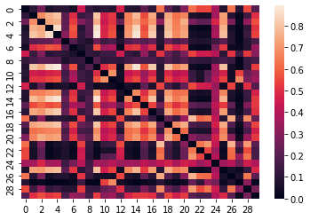

```python
from bs4 import BeautifulSoup
import requests
from lxml import etree
import pandas as pd
import pdfplumber
import io
import langdetect
from sklearn.feature_extraction.text import TfidfVectorizer
from sklearn.metrics.pairwise import cosine_similarity
import os
import re
from unidecode import unidecode
import numpy as np
import matplotlib.pyplot as plt
import seaborn as sns
import networkx as nx
import string
import math
import stanza
from verbecc import Conjugator
import random
from verbecc import ConjugatorError
```


```python
next_page = 1
df = pd.DataFrame()
page_number = 1
```


```python
# Scraping the URLs

for k in range(page_number):
    page = requests.get('https://tel.archives-ouvertes.fr/search/index/?q=%2A&sort=submittedDate_tdate+desc&page='+str(next_page))
    soup = BeautifulSoup(page.text, 'html.parser')
    dom = etree.HTML(str(soup))
    x_path_url = '//*[@id="container"]/div[2]/div/div[2]/div[3]/div[5]/table/tbody/tr[1]/td[2]/div[1]/div/strong/a'
    j = 1
    links = []
    for i in range(30):
        links.append('https://tel.archives-ouvertes.fr/'+dom.xpath(x_path_url)[0].get('href'))
        j+=1
        x_path_url = '//*[@id="container"]/div[2]/div/div[2]/div[3]/div[5]/table/tbody/tr['+str(j)+']/td[2]/div[1]/div/strong/a'
    next_page+=1
    df = df.append(links)
    print('scraping page '+str(k+1)+'/'+str(page_number))
```

    scraping page 1/1
    


```python
df.to_csv('url.csv')
```


```python
# Scraping the theses and downloading them as pdf files

for k in range(len(df)):
    page = requests.get(df.iloc[k,0]+'/document')
    with open('these_'+str(k+1)+'.pdf', 'wb') as f:
        f.write(page.content)
```


```python
# Saving each page as a txt file
# DO NOT RUN THIS, IT TAKES FOREVER

for k in range(len(df)):
    with pdfplumber.open('these_'+str(k+1)+'.pdf') as pdf:
        n_page = len(pdf.pages)
        os.makedirs('these_'+str(k+1))
        for i in range(n_page):
            page = pdf.pages[i]
            text = page.extract_text()
            with io.open(r'these_'+str(k+1)+'\page_'+str(i+1)+'.txt', "w", encoding='utf-8') as text_file:
                if text != None:
                    text_file.write(text)
```


```python
# Saving each thesis as a txt file

for k in range(len(df)):
    with pdfplumber.open(f"these_{str(k+1)}.pdf") as pdf:
        for page in pdf.pages:
            text = page.extract_text()
            with io.open('these_'+str(k+1)+'.txt', "a", encoding='utf-8') as text_file:
                if text != None:
                    text_file.write(text)
```


```python
# Detecting the text language

with open('these_1.txt',encoding='utf-8') as f:
    print(langdetect.detect((f.read())))
```

    en
    


```python
# Setting up sklearn and the source files

vectorizer = TfidfVectorizer()

source = []
for i in range(len(df)):
    with io.open('these_'+str(i+1)+'.txt',encoding='utf-8') as text_file:
        source.append(text_file.read())
```


```python
def cleaner(text):
    return re.sub(r"[^a-zA-Z0-9]", " ", unidecode(text).lower())
```


```python
# Cleaning the source

map_clean = map(cleaner,source)
cleaned_source = list(map_clean)
```


```python
len(cleaned_source[0].split())
```


    53180


```python
response = vectorizer.fit_transform([*cleaned_source])
df_tfidf = pd.DataFrame(response.toarray(),columns=vectorizer.get_feature_names())
```


```python
these_1_tfidf = vectorizer.transform([cleaned_source[0]])
these_2_tfidf = vectorizer.transform([cleaned_source[1]])
cosine_similarity(these_1_tfidf, these_2_tfidf).flatten()
```


    array([0.10384979])


```python
tfidf = []

for i in range(len(df)):
    tfidf.append(vectorizer.transform([cleaned_source[i]]))
```


```python
similarity_matrix = np.zeros((len(tfidf),len(tfidf)))
```


```python
for i in range(len(tfidf)):
    for k in range(len(tfidf)):
        similarity_matrix[i][k] = cosine_similarity(tfidf[i],tfidf[k]).flatten()
```


```python
# Removing self-oriented values, 1s

for i in range(len(similarity_matrix)):
    for k in range(len(similarity_matrix)):
        if math.isclose(similarity_matrix[i][k],1):
            similarity_matrix[i][k] = 0
```


```python
sns.heatmap(similarity_matrix)
plt.rcParams["figure.figsize"] = (10,7)
plt.show()
```


    

    


```python
# Terrible attempt at a network graph

dt = [('len', float)]
A = similarity_matrix*10

A = A.view(dt)

G = nx.from_numpy_matrix(A)
G = nx.relabel_nodes(G, dict(zip(range(len(G.nodes())),string.ascii_uppercase)))    

G = nx.drawing.nx_agraph.to_agraph(G)

G.node_attr.update(color="red", style="filled")
G.edge_attr.update(color="blue", width="2.0")

G.draw('distances.png', format='png', prog='neato')
```


```python
# Creating a smaller similarity matrix

similarity_matrix_20 = np.zeros((20,20))
for i in range(20):
    for k in range(20):
        similarity_matrix_20[i][k] = cosine_similarity(tfidf[i],tfidf[k]).flatten()
similarity_matrix_20 = similarity_matrix_20*10

for i in range(len(similarity_matrix_20)):
    for k in range(len(similarity_matrix_20)):
        if math.isclose(similarity_matrix_20[i][k],1):
            similarity_matrix_20[i][k] = 0
```


```python
graph = nx.convert_matrix.from_numpy_array(similarity_matrix_20)
pos = nx.spring_layout(graph)
nx.draw(graph, pos, with_labels=True)
elarge = [(u, v) for (u, v, d) in graph.edges(data=True) if d["weight"] > 0.5]
esmall = [(u, v) for (u, v, d) in graph.edges(data=True) if d["weight"] <= 0.5]
nx.draw_networkx_nodes(graph, pos, node_size=700)
nx.draw_networkx_edges(graph, pos, edgelist=elarge, width=3)
nx.draw_networkx_edges(
    graph, pos, edgelist=esmall, width=2, alpha=0.5, edge_color="b", style="dashed"
)
plt.show()
```


    

    


```python
stanza.download(lang='fr', model_dir='./stanza_models')
```

    Downloading https://raw.githubusercontent.com/stanfordnlp/stanza-resources/main/resources_1.3.0.json: 142kB [00:00, 2.22MB/s]                    
    2021-12-01 10:44:55 INFO: Downloading default packages for language: fr (French)...
    Downloading https://huggingface.co/stanfordnlp/stanza-fr/resolve/v1.3.0/models/default.zip: 100%|██████████| 572M/572M [49:39<00:00, 192kB/s]
    2021-12-01 11:34:40 INFO: Finished downloading models and saved to ../stanza_models.
    


```python
nlp_fr = stanza.Pipeline(lang='fr',dir='./stanza_models')
```

    2021-12-09 14:07:33 INFO: Loading these models for language: fr (French):
    =======================
    | Processor | Package |
    -----------------------
    | tokenize  | gsd     |
    | mwt       | gsd     |
    | pos       | gsd     |
    | lemma     | gsd     |
    | depparse  | gsd     |
    | ner       | wikiner |
    =======================
    
    2021-12-09 14:07:33 INFO: Use device: cpu
    2021-12-09 14:07:33 INFO: Loading: tokenize
    2021-12-09 14:07:33 INFO: Loading: mwt
    2021-12-09 14:07:33 INFO: Loading: pos
    2021-12-09 14:07:34 INFO: Loading: lemma
    2021-12-09 14:07:34 INFO: Loading: depparse
    2021-12-09 14:07:34 INFO: Loading: ner
    2021-12-09 14:07:35 INFO: Done loading processors!
    


```python
stanza.download(lang='ru', model_dir='./stanza_models')
```

    Downloading https://raw.githubusercontent.com/stanfordnlp/stanza-resources/main/resources_1.3.0.json: 142kB [00:00, 20.0MB/s]                    
    2021-12-01 13:34:00 INFO: Downloading default packages for language: ru (Russian)...
    Downloading https://huggingface.co/stanfordnlp/stanza-ru/resolve/v1.3.0/models/default.zip: 100%|██████████| 574M/574M [03:31<00:00, 2.71MB/s]
    2021-12-01 13:37:37 INFO: Finished downloading models and saved to ./stanza_models.
    


```python
corpus = pd.read_csv('7000 sentences Corpus with IDs.csv')
```


```python
french = corpus['French']
french = french.dropna()
#french = french.to_numpy()
#french = french.tolist()
french = pd.DataFrame(french)
french['stanza'] = ''
french
```


<div>
<style scoped>
    .dataframe tbody tr th:only-of-type {
        vertical-align: middle;
    }

    .dataframe tbody tr th {
        vertical-align: top;
    }

    .dataframe thead th {
        text-align: right;
    }
</style>
<table border="1" class="dataframe">
  <thead>
    <tr style="text-align: right;">
      <th></th>
      <th>French</th>
      <th>stanza</th>
    </tr>
  </thead>
  <tbody>
    <tr>
      <th>0</th>
      <td>J'ai couru après lui en criant son nom mais il...</td>
      <td></td>
    </tr>
    <tr>
      <th>1</th>
      <td>Il est une heure de l'après-midi et nous somme...</td>
      <td></td>
    </tr>
    <tr>
      <th>2</th>
      <td>Jean et Isabelle, vous devrez arriver à jeun a...</td>
      <td></td>
    </tr>
    <tr>
      <th>3</th>
      <td>Les étudiants doivent faire preuve de respect ...</td>
      <td></td>
    </tr>
    <tr>
      <th>4</th>
      <td>Tiens! enlève donc ton pull, tu l'as mis à l'e...</td>
      <td></td>
    </tr>
    <tr>
      <th>...</th>
      <td>...</td>
      <td>...</td>
    </tr>
    <tr>
      <th>2993</th>
      <td>Il est mort d'une septicémie</td>
      <td></td>
    </tr>
    <tr>
      <th>2994</th>
      <td>Les plantes grasses ont des feuilles charnues ...</td>
      <td></td>
    </tr>
    <tr>
      <th>2995</th>
      <td>A vrai dire, je n'y avais pas pensé</td>
      <td></td>
    </tr>
    <tr>
      <th>2996</th>
      <td>N'oublie pas d'emporter le porte-monnaie</td>
      <td></td>
    </tr>
    <tr>
      <th>2997</th>
      <td>Je dois aller chercher mon chéquier à la banqu...</td>
      <td></td>
    </tr>
  </tbody>
</table>
<p>2997 rows × 2 columns</p>
</div>


```python
french['stanza'] = french.apply(lambda x: nlp_fr(x["French"]), axis=1)
french
```

    C:\Users\eleoc\AppData\Local\Programs\Python\Python39\lib\site-packages\stanza\models\common\beam.py:86: UserWarning: __floordiv__ is deprecated, and its behavior will change in a future version of pytorch. It currently rounds toward 0 (like the 'trunc' function NOT 'floor'). This results in incorrect rounding for negative values. To keep the current behavior, use torch.div(a, b, rounding_mode='trunc'), or for actual floor division, use torch.div(a, b, rounding_mode='floor').
      prevK = bestScoresId // numWords
    


<div>
<style scoped>
    .dataframe tbody tr th:only-of-type {
        vertical-align: middle;
    }

    .dataframe tbody tr th {
        vertical-align: top;
    }

    .dataframe thead th {
        text-align: right;
    }
</style>
<table border="1" class="dataframe">
  <thead>
    <tr style="text-align: right;">
      <th></th>
      <th>French</th>
      <th>stanza</th>
    </tr>
  </thead>
  <tbody>
    <tr>
      <th>0</th>
      <td>J'ai couru après lui en criant son nom mais il...</td>
      <td>[\n  [\n    {\n      "id": 1,\n      "text": "...</td>
    </tr>
    <tr>
      <th>1</th>
      <td>Il est une heure de l'après-midi et nous somme...</td>
      <td>[\n  [\n    {\n      "id": 1,\n      "text": "...</td>
    </tr>
    <tr>
      <th>2</th>
      <td>Jean et Isabelle, vous devrez arriver à jeun a...</td>
      <td>[\n  [\n    {\n      "id": 1,\n      "text": "...</td>
    </tr>
    <tr>
      <th>3</th>
      <td>Les étudiants doivent faire preuve de respect ...</td>
      <td>[\n  [\n    {\n      "id": 1,\n      "text": "...</td>
    </tr>
    <tr>
      <th>4</th>
      <td>Tiens! enlève donc ton pull, tu l'as mis à l'e...</td>
      <td>[\n  [\n    {\n      "id": 1,\n      "text": "...</td>
    </tr>
    <tr>
      <th>...</th>
      <td>...</td>
      <td>...</td>
    </tr>
    <tr>
      <th>2993</th>
      <td>Il est mort d'une septicémie</td>
      <td>[\n  [\n    {\n      "id": 1,\n      "text": "...</td>
    </tr>
    <tr>
      <th>2994</th>
      <td>Les plantes grasses ont des feuilles charnues ...</td>
      <td>[\n  [\n    {\n      "id": 1,\n      "text": "...</td>
    </tr>
    <tr>
      <th>2995</th>
      <td>A vrai dire, je n'y avais pas pensé</td>
      <td>[\n  [\n    {\n      "id": 1,\n      "text": "...</td>
    </tr>
    <tr>
      <th>2996</th>
      <td>N'oublie pas d'emporter le porte-monnaie</td>
      <td>[\n  [\n    {\n      "id": 1,\n      "text": "...</td>
    </tr>
    <tr>
      <th>2997</th>
      <td>Je dois aller chercher mon chéquier à la banqu...</td>
      <td>[\n  [\n    {\n      "id": 1,\n      "text": "...</td>
    </tr>
  </tbody>
</table>
<p>2997 rows × 2 columns</p>
</div>


```python
french['word_list'] = ''
```


```python
french['word_list'] = french.apply(lambda x: x["stanza"].to_dict()[0], axis=1)
french
```


<div>
<style scoped>
    .dataframe tbody tr th:only-of-type {
        vertical-align: middle;
    }

    .dataframe tbody tr th {
        vertical-align: top;
    }

    .dataframe thead th {
        text-align: right;
    }
</style>
<table border="1" class="dataframe">
  <thead>
    <tr style="text-align: right;">
      <th></th>
      <th>French</th>
      <th>stanza</th>
      <th>word_list</th>
    </tr>
  </thead>
  <tbody>
    <tr>
      <th>0</th>
      <td>J'ai couru après lui en criant son nom mais il...</td>
      <td>[\n  [\n    {\n      "id": 1,\n      "text": "...</td>
      <td>[{'id': 1, 'text': 'J'', 'lemma': 'il', 'upos'...</td>
    </tr>
    <tr>
      <th>1</th>
      <td>Il est une heure de l'après-midi et nous somme...</td>
      <td>[\n  [\n    {\n      "id": 1,\n      "text": "...</td>
      <td>[{'id': 1, 'text': 'Il', 'lemma': 'il', 'upos'...</td>
    </tr>
    <tr>
      <th>2</th>
      <td>Jean et Isabelle, vous devrez arriver à jeun a...</td>
      <td>[\n  [\n    {\n      "id": 1,\n      "text": "...</td>
      <td>[{'id': 1, 'text': 'Jean', 'lemma': 'Jean', 'u...</td>
    </tr>
    <tr>
      <th>3</th>
      <td>Les étudiants doivent faire preuve de respect ...</td>
      <td>[\n  [\n    {\n      "id": 1,\n      "text": "...</td>
      <td>[{'id': 1, 'text': 'Les', 'lemma': 'le', 'upos...</td>
    </tr>
    <tr>
      <th>4</th>
      <td>Tiens! enlève donc ton pull, tu l'as mis à l'e...</td>
      <td>[\n  [\n    {\n      "id": 1,\n      "text": "...</td>
      <td>[{'id': 1, 'text': 'Tiens!', 'lemma': 'tien', ...</td>
    </tr>
    <tr>
      <th>...</th>
      <td>...</td>
      <td>...</td>
      <td>...</td>
    </tr>
    <tr>
      <th>2993</th>
      <td>Il est mort d'une septicémie</td>
      <td>[\n  [\n    {\n      "id": 1,\n      "text": "...</td>
      <td>[{'id': 1, 'text': 'Il', 'lemma': 'il', 'upos'...</td>
    </tr>
    <tr>
      <th>2994</th>
      <td>Les plantes grasses ont des feuilles charnues ...</td>
      <td>[\n  [\n    {\n      "id": 1,\n      "text": "...</td>
      <td>[{'id': 1, 'text': 'Les', 'lemma': 'le', 'upos...</td>
    </tr>
    <tr>
      <th>2995</th>
      <td>A vrai dire, je n'y avais pas pensé</td>
      <td>[\n  [\n    {\n      "id": 1,\n      "text": "...</td>
      <td>[{'id': 1, 'text': 'A', 'lemma': 'à', 'upos': ...</td>
    </tr>
    <tr>
      <th>2996</th>
      <td>N'oublie pas d'emporter le porte-monnaie</td>
      <td>[\n  [\n    {\n      "id": 1,\n      "text": "...</td>
      <td>[{'id': 1, 'text': 'N'', 'lemma': 'ne', 'upos'...</td>
    </tr>
    <tr>
      <th>2997</th>
      <td>Je dois aller chercher mon chéquier à la banqu...</td>
      <td>[\n  [\n    {\n      "id": 1,\n      "text": "...</td>
      <td>[{'id': 1, 'text': 'Je', 'lemma': 'il', 'upos'...</td>
    </tr>
  </tbody>
</table>
<p>2997 rows × 3 columns</p>
</div>


```python
french['verb'] = ''
french['lemma'] = ''
french['tense'] = ''
```


```python
for i in range(len(french)+1):
    if i == 186:
        continue
    for k in range(len(french['word_list'][i])):
        try:
            if french['word_list'][i][k]['upos'] == 'VERB':
                temp_verb = french['word_list'][i][k]['text']
                temp_lemma = french['word_list'][i][k]['lemma']
                if 'Tense' in french['word_list'][i][k]['feats']:
                    temp_tense = re.search('Tense=(.*)Verb', french['word_list'][i][k]['feats']).group(1)[:-1]
                elif 'VerbForm' in french['word_list'][i][k]['feats']:
                    temp_tense = re.search('VerbForm=(.*)', french['word_list'][i][k]['feats']).group(1)
                break
        except KeyError:
            continue
    french['verb'][i] = temp_verb
    french['lemma'][i] = temp_lemma
    french['tense'][i] = temp_tense
french
```


<div>
<style scoped>
    .dataframe tbody tr th:only-of-type {
        vertical-align: middle;
    }

    .dataframe tbody tr th {
        vertical-align: top;
    }

    .dataframe thead th {
        text-align: right;
    }
</style>
<table border="1" class="dataframe">
  <thead>
    <tr style="text-align: right;">
      <th></th>
      <th>French</th>
      <th>stanza</th>
      <th>word_list</th>
      <th>verb</th>
      <th>lemma</th>
      <th>tense</th>
    </tr>
  </thead>
  <tbody>
    <tr>
      <th>0</th>
      <td>J'ai couru après lui en criant son nom mais il...</td>
      <td>[\n  [\n    {\n      "id": 1,\n      "text": "...</td>
      <td>[{'id': 1, 'text': 'J'', 'lemma': 'il', 'upos'...</td>
      <td>couru</td>
      <td>courir</td>
      <td>Past</td>
    </tr>
    <tr>
      <th>1</th>
      <td>Il est une heure de l'après-midi et nous somme...</td>
      <td>[\n  [\n    {\n      "id": 1,\n      "text": "...</td>
      <td>[{'id': 1, 'text': 'Il', 'lemma': 'il', 'upos'...</td>
      <td>couru</td>
      <td>courir</td>
      <td>Past</td>
    </tr>
    <tr>
      <th>2</th>
      <td>Jean et Isabelle, vous devrez arriver à jeun a...</td>
      <td>[\n  [\n    {\n      "id": 1,\n      "text": "...</td>
      <td>[{'id': 1, 'text': 'Jean', 'lemma': 'Jean', 'u...</td>
      <td>devrez</td>
      <td>devoir</td>
      <td>Fut</td>
    </tr>
    <tr>
      <th>3</th>
      <td>Les étudiants doivent faire preuve de respect ...</td>
      <td>[\n  [\n    {\n      "id": 1,\n      "text": "...</td>
      <td>[{'id': 1, 'text': 'Les', 'lemma': 'le', 'upos...</td>
      <td>doivent</td>
      <td>devoir</td>
      <td>Pres</td>
    </tr>
    <tr>
      <th>4</th>
      <td>Tiens! enlève donc ton pull, tu l'as mis à l'e...</td>
      <td>[\n  [\n    {\n      "id": 1,\n      "text": "...</td>
      <td>[{'id': 1, 'text': 'Tiens!', 'lemma': 'tien', ...</td>
      <td>enlève</td>
      <td>enlever</td>
      <td>Pres</td>
    </tr>
    <tr>
      <th>...</th>
      <td>...</td>
      <td>...</td>
      <td>...</td>
      <td>...</td>
      <td>...</td>
      <td>...</td>
    </tr>
    <tr>
      <th>2993</th>
      <td>Il est mort d'une septicémie</td>
      <td>[\n  [\n    {\n      "id": 1,\n      "text": "...</td>
      <td>[{'id': 1, 'text': 'Il', 'lemma': 'il', 'upos'...</td>
      <td>mort</td>
      <td>mourir</td>
      <td>Past</td>
    </tr>
    <tr>
      <th>2994</th>
      <td>Les plantes grasses ont des feuilles charnues ...</td>
      <td>[\n  [\n    {\n      "id": 1,\n      "text": "...</td>
      <td>[{'id': 1, 'text': 'Les', 'lemma': 'le', 'upos...</td>
      <td>ont</td>
      <td>avoir</td>
      <td>Pres</td>
    </tr>
    <tr>
      <th>2995</th>
      <td>A vrai dire, je n'y avais pas pensé</td>
      <td>[\n  [\n    {\n      "id": 1,\n      "text": "...</td>
      <td>[{'id': 1, 'text': 'A', 'lemma': 'à', 'upos': ...</td>
      <td>dire</td>
      <td>dire</td>
      <td>Inf</td>
    </tr>
    <tr>
      <th>2996</th>
      <td>N'oublie pas d'emporter le porte-monnaie</td>
      <td>[\n  [\n    {\n      "id": 1,\n      "text": "...</td>
      <td>[{'id': 1, 'text': 'N'', 'lemma': 'ne', 'upos'...</td>
      <td>oublie</td>
      <td>oublier</td>
      <td>Pres</td>
    </tr>
    <tr>
      <th>2997</th>
      <td>Je dois aller chercher mon chéquier à la banqu...</td>
      <td>[\n  [\n    {\n      "id": 1,\n      "text": "...</td>
      <td>[{'id': 1, 'text': 'Je', 'lemma': 'il', 'upos'...</td>
      <td>dois</td>
      <td>devoir</td>
      <td>Pres</td>
    </tr>
  </tbody>
</table>
<p>2997 rows × 6 columns</p>
</div>


```python
french.drop(['stanza','word_list'],axis=1,inplace=True)
```


```python
cg = Conjugator(lang='fr')
```


```python
cg.conjugate('enlever')['moods']['subjonctif']['plus-que-parfait']
```


    ["que j'eusse enlevé",
     'que tu eusses enlevé',
     "qu'il eût enlevé",
     'que nous eussions enlevé',
     'que vous eussiez enlevé',
     "qu'ils eussent enlevé"]


```python
temps_mode = ['indicatif','conditionnel','subjonctif']
temps_indicatif = ['présent','imparfait','futur-simple','passé-simple','passé-composé','plus-que-parfait','futur-antérieur','passé-antérieur']
temps_conditionnel = ['présent','passé']
temps_subjonctif = ['présent','imparfait','passé','plus-que-parfait']
```


```python
french['dist_1'] = ''
french['dist_2'] = ''
french['dist_3'] = ''
french['dist_1_tense'] = ''
french['dist_2_tense'] = ''
french['dist_3_tense'] = ''
french['dist_1_pers'] = ''
french['dist_2_pers'] = ''
french['dist_3_pers'] = ''
```


```python
for i in range(len(french)+1):
    if i == 186:
        continue
    lemma = french['lemma'][i]
    try:
        cg.conjugate(lemma)
    except ConjugatorError:
        continue
    for k in range(3):
        mode = random.randint(0,2)
        if mode == 0:
            temps = random.randint(0,7)
            temps_array = temps_indicatif
        elif mode == 1:
            temps = random.randint(0,1)
            temps_array = temps_conditionnel
        else:
            temps = random.randint(0,3)
            temps_array = temps_subjonctif
        if len(cg.conjugate(lemma)['moods'][temps_mode[mode]][temps_array[temps]]) == 0:
            continue
        elif len(cg.conjugate(lemma)['moods'][temps_mode[mode]][temps_array[temps]]) < 6:
            personne = random.randint(0,len(cg.conjugate(lemma)['moods'][temps_mode[mode]][temps_array[temps]])-1)
            personne_out = 0
        else:
            personne = random.randint(0,5)
            personne_out = personne+1
        french['dist_'+str(k+1)][i] = cg.conjugate(lemma)['moods'][temps_mode[mode]][temps_array[temps]][personne]
        french['dist_'+str(k+1)+'_tense'][i] = str(temps_mode[mode])+' '+str(temps_array[temps])
        french['dist_'+str(k+1)+'_pers'][i] = personne_out
french
```

    C:\Users\eleoc\AppData\Local\Temp/ipykernel_21716/179622722.py:28: SettingWithCopyWarning: 
    A value is trying to be set on a copy of a slice from a DataFrame
    
    See the caveats in the documentation: https://pandas.pydata.org/pandas-docs/stable/user_guide/indexing.html#returning-a-view-versus-a-copy
      french['dist_'+str(k+1)][i] = cg.conjugate(lemma)['moods'][temps_mode[mode]][temps_array[temps]][personne]
    C:\Users\eleoc\AppData\Local\Temp/ipykernel_21716/179622722.py:29: SettingWithCopyWarning: 
    A value is trying to be set on a copy of a slice from a DataFrame
    
    See the caveats in the documentation: https://pandas.pydata.org/pandas-docs/stable/user_guide/indexing.html#returning-a-view-versus-a-copy
      french['dist_'+str(k+1)+'_tense'][i] = str(temps_mode[mode])+' '+str(temps_array[temps])
    C:\Users\eleoc\AppData\Local\Temp/ipykernel_21716/179622722.py:30: SettingWithCopyWarning: 
    A value is trying to be set on a copy of a slice from a DataFrame
    
    See the caveats in the documentation: https://pandas.pydata.org/pandas-docs/stable/user_guide/indexing.html#returning-a-view-versus-a-copy
      french['dist_'+str(k+1)+'_pers'][i] = personne_out
    


<div>
<style scoped>
    .dataframe tbody tr th:only-of-type {
        vertical-align: middle;
    }

    .dataframe tbody tr th {
        vertical-align: top;
    }

    .dataframe thead th {
        text-align: right;
    }
</style>
<table border="1" class="dataframe">
  <thead>
    <tr style="text-align: right;">
      <th></th>
      <th>French</th>
      <th>verb</th>
      <th>lemma</th>
      <th>tense</th>
      <th>dist_1</th>
      <th>dist_2</th>
      <th>dist_3</th>
      <th>dist_1_tense</th>
      <th>dist_2_tense</th>
      <th>dist_3_tense</th>
      <th>dist_1_pers</th>
      <th>dist_2_pers</th>
      <th>dist_3_pers</th>
    </tr>
  </thead>
  <tbody>
    <tr>
      <th>0</th>
      <td>J'ai couru après lui en criant son nom mais il...</td>
      <td>couru</td>
      <td>courir</td>
      <td>Past</td>
      <td>que je coure</td>
      <td>que j'eusse couru</td>
      <td>il aurait couru</td>
      <td>subjonctif présent</td>
      <td>subjonctif plus-que-parfait</td>
      <td>conditionnel passé</td>
      <td>1</td>
      <td>1</td>
      <td>3</td>
    </tr>
    <tr>
      <th>1</th>
      <td>Il est une heure de l'après-midi et nous somme...</td>
      <td>couru</td>
      <td>courir</td>
      <td>Past</td>
      <td>vous aurez couru</td>
      <td>il aurait couru</td>
      <td>qu'il coure</td>
      <td>indicatif futur-antérieur</td>
      <td>conditionnel passé</td>
      <td>subjonctif présent</td>
      <td>5</td>
      <td>3</td>
      <td>3</td>
    </tr>
    <tr>
      <th>2</th>
      <td>Jean et Isabelle, vous devrez arriver à jeun a...</td>
      <td>devrez</td>
      <td>devoir</td>
      <td>Fut</td>
      <td>que vous dussiez</td>
      <td>ils doivent</td>
      <td>ils devraient</td>
      <td>subjonctif imparfait</td>
      <td>indicatif présent</td>
      <td>conditionnel présent</td>
      <td>5</td>
      <td>6</td>
      <td>6</td>
    </tr>
    <tr>
      <th>3</th>
      <td>Les étudiants doivent faire preuve de respect ...</td>
      <td>doivent</td>
      <td>devoir</td>
      <td>Pres</td>
      <td>que je dusse</td>
      <td>que vous dussiez</td>
      <td>ils auraient dû</td>
      <td>subjonctif imparfait</td>
      <td>subjonctif imparfait</td>
      <td>conditionnel passé</td>
      <td>1</td>
      <td>5</td>
      <td>6</td>
    </tr>
    <tr>
      <th>4</th>
      <td>Tiens! enlève donc ton pull, tu l'as mis à l'e...</td>
      <td>enlève</td>
      <td>enlever</td>
      <td>Pres</td>
      <td>que vous enleviez</td>
      <td>nous avions enlevé</td>
      <td>vous enleviez</td>
      <td>subjonctif présent</td>
      <td>indicatif plus-que-parfait</td>
      <td>indicatif imparfait</td>
      <td>5</td>
      <td>4</td>
      <td>5</td>
    </tr>
    <tr>
      <th>...</th>
      <td>...</td>
      <td>...</td>
      <td>...</td>
      <td>...</td>
      <td>...</td>
      <td>...</td>
      <td>...</td>
      <td>...</td>
      <td>...</td>
      <td>...</td>
      <td>...</td>
      <td>...</td>
      <td>...</td>
    </tr>
    <tr>
      <th>2993</th>
      <td>Il est mort d'une septicémie</td>
      <td>mort</td>
      <td>mourir</td>
      <td>Past</td>
      <td>ils sont morts</td>
      <td>qu'il soit mort</td>
      <td>qu'ils meurent</td>
      <td>indicatif passé-composé</td>
      <td>subjonctif passé</td>
      <td>subjonctif présent</td>
      <td>6</td>
      <td>3</td>
      <td>6</td>
    </tr>
    <tr>
      <th>2994</th>
      <td>Les plantes grasses ont des feuilles charnues ...</td>
      <td>ont</td>
      <td>avoir</td>
      <td>Pres</td>
      <td>que tu aies</td>
      <td>ils auraient</td>
      <td>tu aurais eu</td>
      <td>subjonctif présent</td>
      <td>conditionnel présent</td>
      <td>conditionnel passé</td>
      <td>2</td>
      <td>6</td>
      <td>2</td>
    </tr>
    <tr>
      <th>2995</th>
      <td>A vrai dire, je n'y avais pas pensé</td>
      <td>dire</td>
      <td>dire</td>
      <td>Inf</td>
      <td>tu dirais</td>
      <td>qu'ils aient dit</td>
      <td>vous aurez dit</td>
      <td>conditionnel présent</td>
      <td>subjonctif passé</td>
      <td>indicatif futur-antérieur</td>
      <td>2</td>
      <td>6</td>
      <td>5</td>
    </tr>
    <tr>
      <th>2996</th>
      <td>N'oublie pas d'emporter le porte-monnaie</td>
      <td>oublie</td>
      <td>oublier</td>
      <td>Pres</td>
      <td>que j'oublie</td>
      <td>vous aviez oublié</td>
      <td>il aura oublié</td>
      <td>subjonctif présent</td>
      <td>indicatif plus-que-parfait</td>
      <td>indicatif futur-antérieur</td>
      <td>1</td>
      <td>5</td>
      <td>3</td>
    </tr>
    <tr>
      <th>2997</th>
      <td>Je dois aller chercher mon chéquier à la banqu...</td>
      <td>dois</td>
      <td>devoir</td>
      <td>Pres</td>
      <td>ils devraient</td>
      <td>vous devriez</td>
      <td>nous aurons dû</td>
      <td>conditionnel présent</td>
      <td>conditionnel présent</td>
      <td>indicatif futur-antérieur</td>
      <td>6</td>
      <td>5</td>
      <td>4</td>
    </tr>
  </tbody>
</table>
<p>2997 rows × 13 columns</p>
</div>


```python
french.to_csv(r'french.csv',encoding='utf-8')
```
